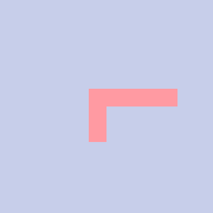

# Basic linear algebra

## Contents
1. [Selecting from a matrix](#selecting-from-matrix)
2. [Updating a matrix](#updating-of-matrix)
3. [Generate a random matrix](#generating-random-matrix)
4. [Testing matrix properties](#testing-matrix-properties)
5. [Elementary operations of a matrix I](#elementary-operations-in-matrix-i)
    - [Matrix addition](#matrix-addition)
    - [Note on floating point arithmetics](#note-on-floating-point-arithmetics)
    - [Matrix multiplication](#matrix-multiplication)
6. [Transpose of a matrix](#transpose-of-matrix)
7. [Determinant and adjoint of a matrix](#determinant-and-adjoint-of-matrix)
8. [Inverse of a matrix](#inverse-of-matrix)
9. [Elementary operations of a matrix II](#elementary-operations-in-matrix-ii)
    - [Matrix elementary row and column operations](#matrix-elementary-row-and-column-operations)
    - [Orthogonal transformations](#orthogonal-transformations)
    - [Givens rotations](#givens-rotations)
    - [Householder reflections](#householder-reflections)
10. [Trace of a matrix](#trace-of-matrix)
11. [LU decomposition](#lu-decomposition)
    - [Gaussian elimination](#gaussian-elimination)
    - [Gaussian elimination with pivoting](#gaussian-elimination-with-pivoting)
    - [LAPACK](#lu-lapack)
12. [QR decomposition](#qr-decomposition)
    - [Least squares problem](#least-squares-problem) - IN PROGRESS
    - [LAPACK](#qr-lapack) - TODO
13. [Rank of a matrix](#rank-of-matrix) - TODO
14. [A partitioned matrix](#partitioned-matrix) - IN PROGRESS

[Project I](#project-i)
[Project II](#project-ii)

[Solutions to exercices](#basic-linear-algebra-solutions-to-exercises)

# Basic linear algebra
Let's start with fundamental results and operations on matrices
that are prerequisite for going further. There are topics that I dive into quite deeply,
others I just stop investigating when accomplishing basic result. This is the reflection
of my subjective thinking what I regard will be especially important to master the later steps.

## Selecting from matrix
Generic selector can be defined by specifying both indices, row's or column's. The way the selection
works can also be extended to higher dimensional arrays, for example, in case of tensor the
plane index should also be additionally specified.
In the first example below the selector allows cutting submatrix by taking first two rows and columns,
ie., via enforcing 0 and 1 indices in the selector:
```
   ]m=: 100 + 4 4 $ i.16
100 101 102 103
104 105 106 107
108 109 110 111
112 113 114 115

   sel=: (<(<0 1),(<0 1))
   sel { m
100 101
104 105
```
There is a way to choose either all columns or all rows by using *a:* :
```
   sel=: (<(<a:),(<0 1))
   sel { m
100 101
104 105
108 109
112 113

   sel=: (<(<2),(<a:))
   sel { m
108 109 110 111
```
Also one can define a selection by saying which indices to omit:
```
sel=: (<(<<2 3 1),(<a:))
   sel { m
100 101 102 103

   sel=: (<(<a:),(<<0 1))
   sel { m
102 103
106 107
110 111
114 115
```
There is also a way to specify indices starting the count from the end via prefixing negative sign
to the index. In that case *_1* is the last index:
```
   sel=: (<(<a:),(<_1))
   sel { x
103 107 111 115
```
It is also possible to combine selections with each other:
```
   sel=:((< (<0 1), (<0 1)),(<(<2 3),(<2 3)))
   sel { m
100 101
104 105

110 111
114 115
```
Let's now see how we can negate a selector and select all elements except those specified by the selector.
Above we were omitting indices in a given axis, now we want to learn how to treat a selection as a mask
and take everything except what the selection frames. As the result can be non-rectangular, we need to
realize the operation in a linearized form to make sure we have a general solution.
After we get the result we can reshape it as we want:
```
   sel=:(< (<1 2), (<1 2))
   sel { m
105 106
109 110

   sel { i.$m
5  6
9 10
   ,sel { i.$m
5 6 9 10

   ]selOmittedIxs =: (< (<< (,sel { i.$m)) ) { ,i.$m
0 1 2 3 4 7 8 11 12 13 14 15

   (< (<< (,sel { i.$m)) ) { ,m
100 101 102 103 104 107 108 111 112 113 114 115

   2 6 $(< (<< (,sel { i.$m)) ) { ,m
100 101 102 103 104 107
108 111 112 113 114 115
```

**Exercise 1**
How to get *m1* that has only elements of *m* with odd indices?
Try two approaches with a selection and a negated selection.
```
100 101 102 103
104 105 106 107  -->   105 107
108 109 110 111        113 115
112 113 114 115
```
[Solution to exercise 1](#solution-to-exercise-1)

**Exercise 2**
Define the tensor that has three planes, the first plane is *m* and the next ones has
corresponding elements increased by 100 and 200 with respect to the first plane.
  (a) cut the tensor using a selection in such a way that only edges containing 100, 112, 103 and 115 (plus 100 and 200) are maintained
  (b) cut the tensor using a selection that only inner (non-surface) elements are maintained

[Solution to exercise 2](#solution-to-exercise-2)

We can also select from a given array by specifying a predicate that filters the array's values.
Let's say we want to select only those values that divide without remainder by 3
```
   3 | (,m)
1 2 0 1 2 0 1 2 0 1 2 0 1 2 0 1
   (0 = 3 | (,m))
0 0 1 0 0 1 0 0 1 0 0 1 0 0 1 0
   pred =: 3 : '(0 = 3 | y) # (i. # y)'
   pred (,m)
2 5 8 11 14
   (pred (,m)) { (,m)
102 105 108 111 114
```

**Exercise 3**
Select all values from *m* that does not divide without remainder by either 3 or 5

[Solution to exercise 3](#solution-to-exercise-3)

Finally, we will see how to introduce functions that act on indices of elements of arrays.
First let's show how to get handle on them:
```
      ]m=: 100 + 4 4 $ i.16
100 101 102 103
104 105 106 107
108 109 110 111
112 113 114 115
   toIxs=: 3 : '(#:i.)@$y'
   toIxs m
0 0
0 1
0 2
0 3

1 0
1 1
1 2
1 3

2 0
2 1
2 2
2 3

3 0
3 1
3 2
3 3
```
In order to get diagonal elements one can do the following:
```
   nub=: 3 : '{./.~ y'
   nub 1 2 3 4 5 6
1 2 3 4 5 6
   nub 1 2 3 4 5 6 1 2 3 4
1 2 3 4 5 6
   < "1 (toIxs m)
┌───┬───┬───┬───┐
│0 0│0 1│0 2│0 3│
├───┼───┼───┼───┤
│1 0│1 1│1 2│1 3│
├───┼───┼───┼───┤
│2 0│2 1│2 2│2 3│
├───┼───┼───┼───┤
│3 0│3 1│3 2│3 3│
└───┴───┴───┴───┘
   diag=: 3 : '1 = # nub y'
   diag "1 (toIxs m)
1 0 0 0
0 1 0 0
0 0 1 0
0 0 0 1

   (diag "1 (toIxs m)) #&,m
100 105 110 115
```
One can also utilize the following scheme to generate diagonal or triangular selections.
*(x u/ y)* returns a table having entries *(a u b)* for every *a* in *x* and *b* in *y*.
```
   ]diag=: =/~ (i.#m)
1 0 0 0
0 1 0 0
0 0 1 0
0 0 0 1
   diag #&,m
100 105 110 115

   ]uppertriang=: (<:)/~ (i.#m)
1 1 1 1
0 1 1 1
0 0 1 1
0 0 0 1
   uppertriang #&,m
100 101 102 103 105 106 107 110 111 115
```

**Exercise 4**
Select two diagonals (diagonal and cross diagonal) of *m* using index function.
Wilkinson diagrams for diagonal and cross diagonal matrices:
```
diagonal             cross diagonal
X 0 0 0 0              0 0 0 0 X
0 X 0 0 0              0 0 0 X 0
0 0 X 0 0              0 0 X 0 0
0 0 0 X 0              0 X 0 0 0
0 0 0 0 X              X 0 0 0 0
```


[Solution to exercise 4](#solution-to-exercise-4)

**Exercise 5**
Select tridiagonal values of *m* that are odd.  Wilkinson diagram of band matrix is
below (a tridiagonal matrix is a special case of a band matrix):
```
X X 0 0 0
X X X 0 0
0 X X X 0
0 0 X X X
0 0 0 X X
```
Do the same for lower bidiagonal matrix (Wilkinson diagram below)
```
X 0 0 0 0
X X 0 0 0
0 X X 0 0
0 0 X X 0
0 0 0 X X
```

[Solution to exercise 5](#solution-to-exercise-5)

**Exercise 6**
Use the tensor from Exercise 2
  (a) cut the diagonal plane from the tensor
  (b) cut the any two ortogonal planes inside the tensor and produce a new two plane tensor out of them

[Solution to exercise 6](#solution-to-exercise-6)

**Summary**: in order to select from a matrix we have quite extensive arsenal at disposal:
(a) we can use J selections,
(b) negated J selections,
(c) deliver functions filtering values,
(d) write index functions,
and finally (e) use combination of those approaches

## Updating of matrix
We can update a matrix with new values and a selection:
```
   sel=: (<(<0 1),(<0 1))
   sel { m
100 101
104 105
   1 sel } m
  1   1 102 103
  1   1 106 107
108 109 110 111
112 113 114 115
```
We need to be sure that the shape of the delivered new values is compatible with what selection determines:
```
   (2 2 $ 1 2 3 4) sel } m
  1   2 102 103
  3   4 106 107
108 109 110 111
112 113 114 115

   sel=: ((<(<0 1),(<0 1)),(<(<2 3),(<2 3)))
   sel { m
100 101
104 105

110 111
114 115

   (1 2 2 $ 1 2 3 4), (1 2 2 $ 5 6 7 9)
1 2
3 4

5 6
7 9
   ((1 2 2 $ 1 2 3 4), (1 2 2 $ 5 6 7 9)) sel } m
  1   2 102 103
  3   4 106 107
108 109   5   6
112 113   7   9

   (2 2 2 $ 1 2 3 4 5 6 7 9) sel } m
  1   2 102 103
  3   4 106 107
108 109   5   6
112 113   7   9
```
The question of ovelapping selection arises. The overwriting is deterministic in a sense that
the selection on the right overwrites the values of the left selection:
```
   sel=: ((<(<0 1),(<0 1)),(<(<1 2),(<1 2)))
   sel { m
100 101
104 105

105 106
109 110
   ((1 2 2 $ 0 0 0 0), (1 2 2 $ 1 1 1 1)) sel } m
  0   0 102 103
  0   1   1 107
108   1   1 111
112 113 114 115
   ((1 2 2 $ 1 1 1 1), (1 2 2 $ 0 0 0 0)) sel } m
  1   1 102 103
  1   0   0 107
108   0   0 111
112 113 114 115
```
There is also a way to update with predicate function:
```
pred =: 4 : '(y > x) # (i. # y)'
   (110 pred (,m)) { (,m)
111 112 113 114 115
   ($m) $ 100 (110 pred (,m)) } ,m
100 101 102 103
104 105 106 107
108 109 110 100
100 100 100 100
```
For matrices, as seen above, one can go through linearized form of matrix (*,*) and
after applying the operation retrieve the shape using (*$*)
We can also use two predicates and apply different updates for each predicate in one go:
```
   pred1 =: 4 : '((y > (0 { x)) *. (y < (1 { x))) # (i. # y)'
   (101 104 pred1 (,m)) { (,m)
102 103

   100 (110 pred (,m)) } ,m
100 101 102 103 104 105 106 107 108 109 110 100 100 100 100 100
   200 (101 104 pred1 (,m)) } ,m
100 101 200 200 104 105 106 107 108 109 110 111 112 113 114 115

   ((5$100),(2$200)) ((110 pred (,m)),(101 104 pred1 (,m))) } ,m
100 101 200 200 104 105 106 107 108 109 110 100 100 100 100 100

   ($m) $ ((5$100),(2$200)) ((110 pred (,m)),(101 104 pred1 (,m))) } ,m
100 101 200 200
104 105 106 107
108 109 110 100
100 100 100 100
```
One can notice that the updating using selection is rectangular in shape and one can
operate in matrix shape doing this. If the updating is done using predcate function
there is no guarantee that the updated slice of a matrix is rectangular, and one needs to
use linearized indices. The same is, in general, true for the negated selection,
ie. updating everything in an array except what a given selection determines. Example below:
```
   sel=:(< (<1 2), (<1 2))
   sel { m
105 106
109 110
   sel { i.$m
5  6
9 10
   ]toUpdateIxs=:(< (<< (,sel { i.$m)) ) { ,i.$m
0 1 2 3 4 7 8 11 12 13 14 15
   ($m) $ 0 toUpdateIxs } ,m
0   0   0 0
0 105 106 0
0 109 110 0
0   0   0 0
```
Now rather than to update with new values let's update the selected elements using
the specified function that uses the old values.
```
   f =: 3 : '(y + 100)'
   (f (sel { m))
205 206
209 210
   (f (sel { m)) sel } m
100 101 102 103
104 205 206 107
108 209 210 111
112 113 114 115
```

**Exercise 7**
Work with the m matrix and using a negated selection update all elements except what below two selections point to:
one selecting 0-1 row and 0-1 column, the second one selecting 3,3 element.
  (a) Set all to be updated elements to 0
  (b) Increment all to be updated elements by 1
  (c) Set all to be updated elements to value that is average of selected elements
  (d) Set all to be updated elements to value that is average of unselected elements

[Solution to exercise 7](#solution-to-exercise-7)

**Exercise 8**
Turn *m* to (a) upper triangular matrix, (b) upper Hessenberg matrix, and (c) upper cross triangular matrix.
Corresponding Wilkinson diagrams:
```
upper Hessenberg     upper triangular    upper cross triangular
X X X X X            X X X X X           X X X X X
X X X X X            0 X X X X           X X X X 0
0 X X X X            0 0 X X X           X X X 0 0
0 0 X X X            0 0 0 X X           X X 0 0 0
0 0 0 X X            0 0 0 0 X           X 0 0 0 0
```

[Solution to exercise 8](#solution-to-exercise-8)

Let's finally investigate how to update some neighborhood of a given point in a matrix. In an example below we want to
increment the nearest neighbors of the point. If the point is going to be defined by *(x,y)* then we will
update 4 points: *(x-1,y)*,*(x+1,y)*,*(x,y-1)*,*(x,y+1)*. The complication that arises here regards points chosen on the
boundary of a matrix. Let's assume that in that case we want to omit the points tresspassing the boundary (in other version
we could also contemplate including them wrapped up on the oppostite side).
```
   nn=: 3 : '( ((0{y)-1), (1{y) ),( ((0{y)+1), (1{y) ),( (0{y), ((1{y)-1) ),:( (0{y), ((1{y)+1) )'

   ]nn11=: nn 1 1
0 1
2 1
1 0
1 2
   ]nn00=: nn 0 0
_1  0
 1  0
 0 _1
 0  1

   NB. let's filter out neighbors that are outside boundary of the matrix
   ]maxR=. (0{$m) - 1
3
   ]maxC=. (1{$m) - 1
3
   validateNeighbors=: 3 : '((0{y) >: 0) *. ((0{y) <: maxR) *. ((1{y) >: 0) *. ((1{y) <: maxC)'
   validateNeighbors (3 1)
1
   validateNeighbors (4 1)
0
   validateNeighbors (3 _1)
0
   validateNeighbors"1 nn00
0 1 0 1
   ]nn00Filtered=: (validateNeighbors"1 nn00) # (i.(0{$nn00)) { nn00
1 0
0 1
   ]nn11Filtered=: (validateNeighbors"1 nn11) # (i.(0{$nn11)) { nn11
0 1
2 1
1 0
1 2

  NB. let's create 0-1 matrix of what to update
   calcIxs=: 3 : '(1{y) + ((0{y)*(maxC+1))'
   calcIxs 0 3
3
   calcIxs 1 3
7
   ($m) $ 1 (calcIxs"1 nn00Filtered) } (,($m) $ 0)
0 1 0 0
1 0 0 0
0 0 0 0
0 0 0 0

   ($m) $ 1 (calcIxs"1 nn11Filtered) } (,($m) $ 0)
0 1 0 0
1 0 1 0
0 1 0 0
0 0 0 0
   ]nn11Ixs=: calcIxs"1 nn11Filtered
1 9 4 6
   ]nn11Vals=: (calcIxs"1 nn11Filtered) { ,m
101 109 104 106
   ]m11=:($m) $ (>: nn11Vals) nn11Ixs } ,m
100 102 102 103
105 105 107 107
108 110 110 111
112 113 114 115

   NB.checking the correctness
   m11 - m
0 1 0 0
1 0 1 0
0 1 0 0
0 0 0 0

   NB. the same for (0,0) point
   ]nn00Ixs=: calcIxs"1 nn00Filtered
4 1
   ]nn00Vals=: (calcIxs"1 nn00Filtered) { ,m
104 101
   ]m00=:($m) $ (>: nn00Vals) nn00Ixs } ,m
100 102 102 103
105 105 106 107
108 109 110 111
112 113 114 115
   m00 - m
0 1 0 0
1 0 0 0
0 0 0 0
0 0 0 0
```

**Exercise 9**
Show capability to update (decrement) the nearest neighbors in a tensor

[Solution to exercise 9](#solution-to-exercise-9)

**Exercise 10**
(a) Show capability to update (increment) the second nearest neighbors in a matrix.
(b) Also show updating simultaneuously the nearest neighbors of two points at the same time
(both incrementing, then one incrementing second decrementing)
(c) Also show updating simultaneuously the nearest neighbors (incrementing) and
second nearest neighbors (decrementing)

[Solution to exercise 10](#solution-to-exercise-10)

**Exercise 11**
Show capability to update (make 0) both diagonals passing through the point.

[Solution to exercise 11](#solution-to-exercise-11)

**Summary**: As in the case of selecting the updating of a matrix can be realized in a number of ways:
(a) via J selections which requires rectangular updating values mimicking the shape of the selection,
(b) negated selections but then we need to work with linearized indices,
(c) functions acting on both values or indices to filtering out indices to be updated
(d) on top of indices to be updated we can provide new values independent or dependent
on the current values
(e) finally we can extend updating spacially, ie. beyond pointwise updating, and come up with neighborhood updating

## Generating random matrix
Let's start to revisit what are basic functionalities in J when it comes to vector random generation.
When we want to pick N natural numbers from 0 up to M-1, then it can be achieved via `?N#M`:
```
   ?6#6
1 3 3 2 0 2
   ?6#6
5 2 1 5 2 0
   ?6#6
2 5 5 0 1 5
   ?10#6
2 3 3 1 1 5 4 3 4 4
   ?10#6
0 0 3 1 1 1 2 3 5 2
   1+?6#6
3 6 6 3 1 4
   1+?6#6
3 5 3 6 1 3
```
In the first three examples we picked 6 numbers from the set {0,1,2,3,4,5}, the next two 10 numbers from the same set.
In the last example, we picked 6 numbers from the set {1,2,3,4,5,6}.
But what if we want to choose the set in completely arbitrary way? Well, we can exploit selecting capability we have already mastered:
```
   domain=: _1 1
   ( 10 ?@$ #domain) { domain
_1 1 1 1 1 _1 1 1 _1 _1
   ( 10 ?@$ #domain) { domain
1 1 1 _1 _1 _1 1 _1 _1 1

   domain=: 1 10 100 1000
   ( 10 ?@$ #domain) { domain
100 100 10 1 10 1000 100 10 100 10
   ( 10 ?@$ #domain) { domain
1 1000 1 100 100 1 1 1000 1000 100
```

These were **random sampling with replacement**. If we want to pick a sequence of elements from a given domain **without replacement** we can use `?` with
the remark that the number of picked numbers cannot exceed the cardinality of the domain:
```
   domain=: 1 10 100 1000
   ( 1 ? #domain) { domain
100
   ( 2 ? #domain) { domain
1000 1
   ( 3 ? #domain) { domain
10 1000 100
   ( 4 ? #domain) { domain
100 10 1 1000
   ( 5 ? #domain) { domain
|domain error
|   (5    ?#domain){domain

```

Now what if we want to set relative weights to the elements of domain? On the one hand we can replicate accordingly elements in the domain.
So if we want to have 100 picked 3 times more frequently than any other number in the domain we could set domain the following:
```
   domain=: 1 10 100 100 100 1000
```

The following reference [https://code.jsoftware.com/wiki/Fifty_Shades_of_J/Chapter_28] suggests:
```
   cumulativeWeights=: +/\ % +/
   cumulativeWeights 1 1 3 1
0.166667 0.333333 0.833333 1
   rnd=: ?@#&0
   rnd 5
0.797844 0.357451 0.817211 0.397167 0.160679
   rndWeighted=: cumulativeWeights@[ I. rnd@]
   1 1 3 1 rndWeighted 10
2 2 2 3 1 2 3 2 3 1
```
`rnd` picks random number from (0,1) interval, the last line picks 10 random numbers from a set {0,1,2,3} where
element 3 has relative weight 3 with respect to other elements of the domain that all have relative weight equal to 1.

Now, let's see how we can use arbitrary domain using both approaches.
```
   domain=: 1 10 100 1000
   (1 1 3 1 rndWeighted 10) { domain
1000 1 100 100 1000 100 10 1 100 10
   domain=: 1 10 100 100 100 1000
   ( 10 ?@$ #domain) { domain
1000 1000 100 1000 100 100 1000 100 100 100
```
**Exercise 12**
Show that the both above-mentioned approaches give approximately the same result when the number of picks is substantial.
In the both approaches element 100 has 3 times bigger frequency than the rest elements of the domain, ie., element 100 should occur
approximately 50% time, the rest three elements should be equally frequent.

[Solution to exercise 12](#solution-to-exercise-12)

The exercise 12 is of great importance as it elucidates one of the possible powerful strategies that we will use later to show that our assumptions are valid
or to confirm experimentally the mathematical relations. Basically the strategy bogs down to repeating million or so times the toss, utilizing the randomness of number generation,
proper counting of the resultant observations, correct aggregation of them and drawing the proper conclusion.
It is great asset of J that such massive experiments are up for grabs for us. Moreover, we will encounter numerous situations that the simulation act not just as
a proxy for lemma or theorem or just some finding, which is very reassuring, but sometimes is the only quick way to get to the result as analytical solution
is very nontrivial or only intricate approximation can be provided.

Now we are empowered to replicate **binomial distribution**. We need to set binary domain and weights being probabilities,
ie. two positive numbers that add up to 1. Traditionally, domain reflects **Bernoulli trial** which is experiment with two outcomes
possible, 1 representing success with probability p, 0 representing failure with probability (1-p) [6, page 89-91].
We can generalize domain though.
```
   cumulativeWeights=: +/\ % +/
   rnd=: ?@#&0
   rndWeighted=: cumulativeWeights@[ I. rnd@]
   domain=: 0 1
   (0.3 0.7 rndWeighted 10) { domain
1 1 1 0 1 1 0 1 0 1
   domain=: _1 1
   (0.15 0.85 rndWeighted 10) { domain
1 1 1 _1 1 1 1 1 1 1
```
**Exercise 13**
Explore two generalized binomial distributions:
(a) (1,p) and (0,1-p) where p is (0,1),
(b) (1, p) and (22, 1-p) where p is (0,1).
Demonstrate that if the number of tials is big enough the weights (ie. probabilities) are replicated.
Calculate experimental mean and variance of Bernoulli random variables and compare to the theoretical results.

[Solution to exercise 13](#solution-to-exercise-13)

Moreover, random numbers 0 and 1 in binomial distribution can be obtained via `binomialrand` - see [https://code.jsoftware.com/wiki/Addons/stats/base/random]
```
   load 'stats/base/random'
   NB. probability of success=0.2, number of trials 10
   binomialrand 0.2 10
0 0 0 0 1 0 0 0 0 0
```

Let's now investigate two continuous distributions: normal and uniform. A **normal distribution** example is below:
```
   NB. `rnorm` is defined in j/algebra.ijs and takes as x mean and variance, and number of samples as y
   0 1 rnorm 10
_0.22246 0.565404 _0.81757 _1.44307 1.37019 1.32798 _0.325787 0.85836 _0.586362 0.751552

   10 2 rnorm 10
7.79113 7.16799 12.1581 8.78351 10.3067 9.38921 11.7871 11.0787 8.18868 10.8973
```
We can now see using `intervalHist` from j/algebra.ijs how the generated samples are distributed:
```
   ]bins=: 0.2*i:15
_3 _2.8 _2.6 _2.4 _2.2 _2 _1.8 _1.6 _1.4 _1.2 _1 _0.8 _0.6 _0.4 _0.2 0 0.2 0.4 0.6 0.8 1 1.2 1.4 1.6 1.8 2 2.2 2.4 2.6 2.8 3
   bins intervalHist (0 1 rnorm 100)
┌────────┬─────┬────┐
│interval│count│freq│
├────────┼─────┼────┤
│  _3    │ 0   │   0│
│_2.8    │ 0   │   0│
│_2.6    │ 0   │   0│
│_2.4    │ 0   │   0│
│_2.2    │ 1   │0.01│
│  _2    │ 2   │0.02│
│_1.8    │ 0   │   0│
│_1.6    │ 1   │0.01│
│_1.4    │ 2   │0.02│
│_1.2    │ 3   │0.03│
│  _1    │ 6   │0.06│
│_0.8    │ 5   │0.05│
│_0.6    │ 5   │0.05│
│_0.4    │ 9   │0.09│
│_0.2    │13   │0.13│
│   0    │12   │0.12│
│ 0.2    │10   │ 0.1│
│ 0.4    │ 5   │0.05│
│ 0.6    │ 6   │0.06│
│ 0.8    │ 6   │0.06│
│   1    │ 5   │0.05│
│ 1.2    │ 5   │0.05│
│ 1.4    │ 2   │0.02│
│ 1.6    │ 0   │   0│
│ 1.8    │ 1   │0.01│
│   2    │ 0   │   0│
│ 2.2    │ 1   │0.01│
│ 2.4    │ 0   │   0│
│ 2.6    │ 0   │   0│
│ 2.8    │ 0   │   0│
│   3    │ 0   │   0│
└────────┴─────┴────┘

   bins intervalHist (0 1 rnorm 1e6)
┌────────┬─────┬──────────┐
│interval│count│freq      │
├────────┼─────┼──────────┤
│  _3    │ 1337│  0.001337│
│_2.8    │ 1191│  0.001191│
│_2.6    │ 2124│  0.002124│
│_2.4    │ 3577│  0.003577│
│_2.2    │ 5733│0.00573301│
│  _2    │ 8883│0.00888301│
│_1.8    │13485│  0.013485│
│_1.6    │18618│  0.018618│
│_1.4    │26150│   0.02615│
│_1.2    │34150│   0.03415│
│  _1    │43414│  0.043414│
│_0.8    │53318│ 0.0533181│
│_0.6    │62517│ 0.0625171│
│_0.4    │70226│ 0.0702261│
│_0.2    │76195│ 0.0761951│
│   0    │78716│ 0.0787161│
│ 0.2    │79239│ 0.0792391│
│ 0.4    │76277│ 0.0762771│
│ 0.6    │70208│ 0.0702081│
│ 0.8    │62095│ 0.0620951│
│   1    │53518│ 0.0535181│
│ 1.2    │43695│  0.043695│
│ 1.4    │34461│  0.034461│
│ 1.6    │26138│  0.026138│
│ 1.8    │18898│  0.018898│
│   2    │12913│  0.012913│
│ 2.2    │ 8858│0.00885801│
│ 2.4    │ 5760│0.00576001│
│ 2.6    │ 3556│  0.003556│
│ 2.8    │ 2120│   0.00212│
│   3    │ 1175│  0.001175│
│        │ 1454│  0.001454│
└────────┴─────┴──────────┘
```

**Exercise 14**
Show that 1-,2-, 3- sigma interval probabilities can be reasonable assessed using `rnorm`.

[Solution to exercise 14](#solution-to-exercise-14)


Finally, we can look at **uniform distribution** sample generation (`runiform` is in j/algebra.ijs ):
```
   NB. 10 samples of U(0,1)
   0 1 runiform 10
0.183411 0.0968962 0.587723 0.165308 0.68218 0.0916652 0.00554653 0.149567 0.340257 0.370271

   ]bins=.(0.2&*) <: i.8
_0.2 0 0.2 0.4 0.6 0.8 1 1.2
   bins intervalHist (0 1 runiform 100)
┌────────┬─────┬────┐
│interval│count│freq│
├────────┼─────┼────┤
│_0.2    │ 0   │   0│
│   0    │ 0   │   0│
│ 0.2    │23   │0.23│
│ 0.4    │17   │0.17│
│ 0.6    │17   │0.17│
│ 0.8    │21   │0.21│
│   1    │22   │0.22│
│ 1.2    │ 0   │   0│
└────────┴─────┴────┘

   bins intervalHist (0 1 runiform 1e6)
┌────────┬──────┬────────┐
│interval│count │freq    │
├────────┼──────┼────────┤
│_0.2    │     0│       0│
│   0    │     0│       0│
│ 0.2    │199601│0.199601│
│ 0.4    │200025│0.200025│
│ 0.6    │199935│0.199935│
│ 0.8    │199972│0.199972│
│   1    │200467│0.200467│
│ 1.2    │     0│       0│
└────────┴──────┴────────┘
```

**Exercise 15**
Generate 10x10 random upper triangular matrix where elements are N(2,3).

[Solution to exercise 15](#solution-to-exercise-15)

**Exercise 16**
Generate 10x10 random diagonal matrix where elements are U(20,30).

[Solution to exercise 16](#solution-to-exercise-16)

**Exercise 17**
Generate 8x5 matrix where consecutive columns consist of random and evenly probable pairs: (1,2), (3,4), (5,6),...

[Solution to exercise 17](#solution-to-exercise-17)

In-depth coverage of many both discrete and continuous distribution families will be included in statistics inference chapter.

The last topics to cover when introducing basic random generation are **random generators** and **seeds**.
We have the following random generators at our disposal (adapted from [https://code.jsoftware.com/wiki/Vocabulary/query])

|     code      |      rng           | relative cost  |
| ------------- |:------------------:| --------------:|
|       1       |    GB_Flip         |        1       |
|       2       | Mersenne Twister   |        1       |
|       3       |    DX-1597-4d      |        3       |
|       4       |     MRG32k3a       |        8       |
|       0       | combination of all |       12       |

Below is self-explanatory code snippet.
```
   NB. show current rng (Mersenne Twister is default)
   9!:42 ''
2
   NB. set new rng
   9!:43 ]1

   9!:42 ''
1

   rng=.9!:42
   rng ''
1
   NB. set seed=2000 to current rng
   rngWithSeed2000=. 2{.2000,rng ''
   9!:43 {:rngWithSeed2000

   NB. reset the state of rng with seed
   9!:1  {.rngWithSeed2000

   NB. generating 5 samples of N(0,1)
   0 1 rnorm 5
_1.42716 _0.353494 0.0569464 _0.300366 0.752976
   0 1 rnorm 5
0.58307 _1.25819 1.05434 1.09644 _0.294877

   NB. reset the state of rng with seed
   9!:1  {.rngWithSeed2000

   NB. now 5 sample of N(0,1) should be the same as immediately after previous rng's state reset
   NB. the rng's state reset functionality will be important later for experiment's reproducibility
   0 1 rnorm 5
_1.42716 _0.353494 0.0569464 _0.300366 0.752976
```

The above is functionality is enough to have a basic control of random generation.
More information can be found here [https://code.jsoftware.com/wiki/Essays/RNG].

**Summary**: The basic random generation capabilities of J were covered. We know how to
(a) toss with repetition and without repetition,
(b) set arbitrary domain and give weights to elements of the domain,
(c) pick random samples from normal and uniform distributions,
(d) get frequency report of the generated samples,
(e) use substantial number generation to reason about properties of distributions, like mean or variance,
(f) set random number generator with default or arbitrary seed,
(g) reset the state of the generator.

## Testing matrix properties
In the coming chapters we will develop many techniques and recipies, and to have reasonable confidence the proposed
solution is correct we will adapt **property testing**. The scheme I will adopt is following:
1. Implement a concept **C** (eg. transpose, SVD, ...)
2. Refer to the facts, formulas, lemmas and proofs of mathematics and construct **leftR R rightR**
Here both leftR and rightR can contain the concept **C** (and possibly others) and establish relation **R** (eg. =, <=, ...)
3. As both **leftR** and **rightR**, in general, act on sequence of arrays we will need to deliver it. Very often they will need to be special
arrays, due to the shape or the array type constraints
4. Rather than handcrafting the arrays we will rely on the generated array instances. The developments of previous section will be very useful indeed
5. We will repeat the experiment many times, with the expectation that in every experiment the property we are verifying
holds

This is a standard procedure, for example in Haskell development, were we construct a property, implement `Arbitrary` instances, and then
upon property testing, proper array instances are generated and the property is tried with them. As I am convinced this is the proper and
the required approach I will adopt it as well here.

## Elementary operations in matrix I
We have the following basic results.

### Matrix addition
Let's have matrices of the same order: A, B, C and scalars s<sub>1</sub> and s<sub>2</sub>. Then we have [2, pages 5]:
- 
- 
- 
- 
- 
- 

Let's develop how we can perform property test of the first equality. According to the scheme proposed above we need to:
1. have a way to generate two arbitrary matrices of the same shape
```
genUniformMatrix=: 3 : 'y $ _1000 1000 runiform ((0{y) * (1{y))'
   genUniformMatrix 2 2
 _226.76 _322.805
_808.466  202.957
   genUniformMatrix 4 2
_428.685  853.433
_400.652 _164.792
 375.372  675.547
 584.175 _69.8546
```
2. have a way to check **leftR R rightR** with the generated matrices
```
   leftR=: 4 : 'x + y'
   rightR=: 4 : 'y + x'
   relation=: leftR`rightR
      relation@.0
4 : 'x + y'
      relation@.1
4 : 'y + x'

   checkEqTwoMatrices=: 4 : '( (0{y) x@.0 (1{y) ) = ( (0{y) x@.1 (1{y) )'
   ]matrices=: (genUniformMatrix 4 2),:(genUniformMatrix 4 2)
 783.326  777.188
 433.257  992.401
_44.5578   892.71
 850.185   636.44

 211.161 _619.827
 464.316 _601.967
 309.364  851.114
_181.237  238.782
   NB. all elements the same
   relation checkEqTwoMatrices matrices
1 1
1 1
1 1
1 1
   (0{matrices) (relation@.0) (1{matrices)
994.487  157.36
897.573 390.434
264.806 1743.82
668.948 875.221
   (0{matrices) (relation@.1) (1{matrices)
994.487  157.36
897.573 390.434
264.806 1743.82
668.948 875.221
   NB. let's redefine check in such a way that it returns 1 only if all elements are the same,
   NB. ie. we have perfect matching
   checkEqTwoMatrices=: 4 : '( (0{y) x@.0 (1{y) ) -: ( (0{y) x@.1 (1{y) )'
   relation checkEqTwoMatrices matrices
1
```
3. finally, repeat the check many times for different shapes (as an example dimensions are independently picked from 1 ... 100 domain)
```
   run=: 3 : 0
shape=.1+?2#100
m=.(genUniformMatrix shape),:(genUniformMatrix shape)
relation checkEqTwoMatrices m
)
   NB. now let's run it 100 times
   (+/)(run"0)100#0
100
```
Now, I am reasonably confident that matrix addition as implemented in J is a commutative operator, ie.  holds. I intend to verify each property like that onwards.

**Exercise 18**
Perform property testing for the rest addition properties specified above

[Solution to exercise 18](#solution-to-exercise-18)

### Note on floating point arithmetics

Let's revisit the following property 


```
   leftR=: {{
s=.0{x
A=.>(0{y)
B=.>(1{y)
s*(A + B)
}}
   rightR=: {{
s=.0{x
A=.>(0{y)
B=.>(1{y)
(s*A) + (s*B)
}}
   relation=: leftR`rightR
   run=: 3 : 0
shape=.1+?2#100
m=.(genUniformMatrix shape);(genUniformMatrix shape)
s=. _100 100 runiform 1
data=.s;<m
relation checkEqOfMatricesScalarsRel data
)
   (+/)(run"0)100#0
37
```
The last result is equivalent to saying that 57 out of 100 sample cases failed to validate this property. This is due  to floating-point addition that is not associative or distributive.
When testing the properties we would like to have a way to (1) detect and inspect the failing cases, (2) control the limitations of floating point arithmetics.

Let's see how to detect the failing cases for inspection - adapted basing on [http://jsoftware.com/pipermail/programming/2022-January/059566.html].
```
   data=.(_100 100 runiform 1);<((genUniformMatrix 50 50);(genUniformMatrix 50 50))
   relation checkEqOfMatricesScalarsRel data
1
   data=.(_100 100 runiform 1);<((genUniformMatrix 50 50);(genUniformMatrix 50 50))
   relation checkEqOfMatricesScalarsRel data
1
   data=.(_100 100 runiform 1);<((genUniformMatrix 50 50);(genUniformMatrix 50 50))
   relation checkEqOfMatricesScalarsRel data
0
   showmismatch=: 4 : '($#:I.@,) ((0{::y) x@.0 (1{::y)) ~: (0{::y)x@.1(1{::y)'
   relation showmismatch data
20 39
42 31
   s=: 0 {:: data
   'A B'=: (<20 39)&{"2]>1{:: data
   s*(A + B)
23.8806
   (s*A) + (s*B)
23.8806
   (s*(A + B)) - ((s*A) + (s*B))
2.77467e_12
   NB. We inspected that this is due to floating-point arithmetic errors
```

In order to harness the deficiencies of floating point arithmetic we will try two approaches. In the first one we will decrease strictness of comparison tolerance.
The comparison tolerance determines what is the minimum number difference that is assumed to treat the compared numbers as the same. This influence the `=` so also
`-:`. If the comparison tolerance is smaller than the floating point errors then we experience floating-point inequality although we should have equality. So one
approach would be to increase comparison tolerance:
```
   9!:18 ''
5.68434e_14
   9!:19 ]1e_11

   9!:18 ''
1e_11
   (+/)(run"0)100#0
100
   (+/)(run"0)1000#0
991
```
Making comparison tolerance less strict helped a lot, but we are still not perfect.
Next, we will try to use `x:` ie., enforcing rational represention of y.
```
   toRational=:x:
   leftR=: {{
s=.0{x
A=.>(0{y)
B=.>(1{y)
(toRational s)*( (toRational A) + (toRational B) )
}}
   rightR=: {{
s=.0{x
A=.>(0{y)
B=.>(1{y)
( (toRational s)*(toRational A) ) + ( (toRational s)*(toRational B) )
}}
         relation=: leftR`rightR
         run=: 3 : 0
shape=.1+?2#100
m=.(genUniformMatrix shape);(genUniformMatrix shape)
s=. _100 100 runiform 1
data=.s;<m
relation checkEqOfMatricesScalarsRel data
)
   (+/)(run"0)100#0
100
   (+/)(run"0)1000#0
1000
```
We are perfect now, but with a caveat. The additional execution cost is substantial - tests run an order of magnitude longer than corresponding the previous approach.
So the control over floating-point arithmetic bogs down to trying another approach unless we get 1000 out of 1000 tries. If using rational conversion does not help then we
need to reconsider the property itself.

### Matrix multiplication

We have the following basic properties of matrix multiplication:
- 
- 
- 

The matrix multiplication is defined as
```
   mult=: +/ .*
   ]a=: 2 2 $ 1 2 3 4
1 2
3 4
   ]b=: 2 4 $ 1 2
1 2 1 2
1 2 1 2
   ]c=: a mult b
3  6 3  6
7 14 7 14
   $c
2 4
```

**Exercise 19**
Compute the n-th Fibonacci number by using the matrix form [https://en.wikipedia.org/wiki/Fibonacci_number#Matrix_form]

[Solution to exercise 19](#solution-to-exercise-19)

**Exercise 20**
Perform property testing for the multiplication properties specified above

[Solution to exercise 20](#solution-to-exercise-20)


### Transpose of matrix
The transpose is defined as follows:
```
   transpose=: |:
   transpose (2 3 $ 1 2 3 4 5 6)
1 4
2 5
3 6
   transpose (transpose (2 3 $ 1 2 3 4 5 6))
1 2 3
4 5 6
```
We have also the following properties [2, page 6]
- 
- 
- 

**Exercise 21**
Perform property testing for transpose properties.

[Solution to exercise 21](#solution-to-exercise-21)

We can also introduce transpose for arbitrary dimension n > 2 arrays. In such a case we have `n!` ways of transposing
hence the transpose and those ways are expressed as permutations
```
   ]tensor=:i. 3 2 2
 0  1
 2  3

 4  5
 6  7

 8  9
10 11
   (0 1 2) |: tensor
 0  1
 2  3

 4  5
 6  7

 8  9
10 11
   (2 1 0) |: tensor
0 4  8
2 6 10

1 5  9
3 7 11
   (2 0 1) |: tensor
0  2
4  6
8 10

1  3
5  7
9 11
```

### Determinant and adjoint of matrix

Let's first look at a **principal submatrix** of a square matrix. For a given square matrix **A** a principle matrix specified by (i,j)
which (i,j) denotes a valid pair of indices in the **A** is a square submatrix of **A** formed by deleting the i-th row and j-th column.
The following function [see https://code.jsoftware.com/wiki/Essays/Matrix_Inverse] shows all principal submatrices of a given matrix
organized by rows (each row is in each 2D plane). So in the following example in the first plane we have principal submatrices specified by
(0,0), (0,1) and (0,2).
```
   principalSubmatrices =: 1 |:\."2^:2 ]
   ]m=: i. 3 3
0 1 2
3 4 5
6 7 8
   principalSubmatrices (i. 3 3)
4 5
7 8

3 5
6 8

3 4
6 7


1 2
7 8

0 2
6 8

0 1
6 7


1 2
4 5

0 2
3 5

0 1
3 4

  NB. principal submatrix x of y
  principalSubmatrix=: 4 : '(<(<(0{x)),(<(1{x))) { (principalSubmatrices y)'

   0 1 principalSubmatrix m
3 5
6 8
   2 2 principalSubmatrix m
0 1
3 4
```
We can also utilize the technique developed in the section covering selecting from matrix. It is
expected to be more performant than the above one basing on retrieving all principal submatrices.
```
   ]m=: i. 3 3
0 1 2
3 4 5
6 7 8
   principalSubmatrix=: 4 : '(<(<<(0{x)),(<<(1{x))) { y'
   0 0 principalSubmatrix m
4 5
7 8
   1 0 principalSubmatrix m
1 2
7 8
```

Determinant of a square matrix is specified as below:
```
   det=: -/ .*
   det m
0
```

**Exercise 22**
Show for 4x4 random matrix with integer elements from 0 to 20 that determinant of this matrix is a sum
of determinants of principal submatrices (row-wise or column-wise), called *minors*, multiplied by elements at (i,j) (and negated when (i+j) is odd)

[Solution to exercise 22](#solution-to-exercise-22)

Noteworthy properties of determinant [2, page 10]
- 
- 
-  for any scalar `s`

**Exercise 23**
Add property testing for the determinant properties.

[Solution to exercise 23](#solution-to-exercise-23)

For the record, **minor** of an element   is the determinant of a square submatrix
that is obtained from a matrix *A* by deleting the i-th row and j-th column.
The **cofactor** of  is the minor of  times .
The **cofactor matrix** is matrix composed of all cofactors in a given matrix.
The **adjoint** of *A*,  , is a transpose of the cofactor matrix of *A*.

```
   adjoint=: [: |: */~@($&1 _1)@# * det@principalSubmatrices
   ]m=: i. 3 3
0 1 2
3 4 5
6 7 8
   adjoint m
_3   6 _3
 6 _12  6
_3   6 _3
   det m
0
   NB. Product of first column of m and first column of adjoint of m is determinant.
   (_3*0)+(3*6)+(6*_3)
0
   NB. the same for all other columns and rows as was checked in Exercise 24.
```

The adjoint matrix has a number of interesting properties [2, page 11]:
- 
- 

**Exercise 24**
Add property testing for the adjoint relations.

[Solution to exercise 24](#solution-to-exercise-24)

For nonsingular *A* have also an important relation 
```
   inv=: adjoint % det
   domain=: 1 2 3 5 8 11
   ]m=: 3 3 $ ( 9 ?@$ #domain) { domain
5 2 11
1 3  3
1 5  2
   NB. conversion to rational
   toR=: x:
   ]invm=: toR (inv m)
  3r7 _17r7    9r7
_1r21  1r21   4r21
_2r21 23r21 _13r21
   invm mult m
1 0 0
0 1 0
0 0 1
```

### Inverse of matrix

When a **square matrix A** is nonsingular (ie., its rank is equal to its row/column dimension) then there exists
matrix **B** (called the inverse of A) of the same shape that satisfies:


The calculation of rank and its properties will be covered after introducing SVD decomposition as
the numerical rank can be determined as a side effect of the decomposition (also possible using QR or LU although
not so reliable as in case of SVD).

More performant inverse of a square matrix is defined as `%.` (than the one defined on adjoint)
```
   NB. nonsingular matrix has an inverse (each row, so also the column, is linearly independent)
   ]m=: 3 3 $ 1 2 3 5 4 6 9 7 8
1 2 3
5 4 6
9 7 8
   ]invm=: %. m
 _0.666667 0.333333    0
  0.933333 _1.26667  0.6
_0.0666667 0.733333 _0.4
   inv, mult m
           1            0 0
           0            1 0
_4.44089e_16 _4.44089e_16 1
   (toRational invm) mult m
1 0 0
0 1 0
0 0 1

   NB. singular matrix does not an inverse (notice that row 1 is twice of row 0)
   ]m=: 3 3 $ 1 2 3 2 4 6 9 7 8
1 2 3
2 4 6
9 7 8
   ]invm=: %. m
_. _. _.
_. _. _.
_. _. _.

```

Let's investigate the main property. First we will property test
- 
```
   leftR=: 4 : '(%. (>0{y) ) mult (>0{y)'
   rightR=: 4 : '(>0{y) mult (%. (>0{y) )'
   relation=: leftR`rightR
   run=: 3 : 0
d=.1+?1#30
data=._1;<(genUniformMatrix (d,d))
relation checkEqOfMatricesScalarsRel data
)
   (+/)(run"0)1000#0
1000
```
Now, we will test
- 
```
   inv=: %.
   leftR=: 4 : '(inv (>0{y) ) mult (>0{y)'
   rightR=: 4 : '>1{y'
   relation=: leftR`rightR
   run=: 3 : 0
d=.1+?1#20
data=._1;<( (genUniformMatrix (d,d)); (=/~ (i.d)) )
relation checkEqOfMatricesScalarsRel data
)
   run 0
0
   ]d=.1+?1#30
6
   ]data=._1;<((genUniformMatrix (d,d));(=/~ (i.d)) )
┌──┬───────────────────────────────────────────────────────────────────┐
│_1│┌─────────────────────────────────────────────────────┬───────────┐│
│  ││ 44.3295  591.303  430.928  421.416 _695.587  666.632│1 0 0 0 0 0││
│  ││_721.179  _867.88  599.228 _197.815  _771.76  201.802│0 1 0 0 0 0││
│  ││ 885.758   _438.9  417.417 _294.439  58.2094 _474.602│0 0 1 0 0 0││
│  ││_198.792 _849.979  131.914  613.662 _173.348 _319.625│0 0 0 1 0 0││
│  ││_862.958  532.931 _122.465 _738.311 _128.379  956.947│0 0 0 0 1 0││
│  ││_322.232 _402.396  _341.93 _561.943  721.986 _13.3718│0 0 0 0 0 1││
│  │└─────────────────────────────────────────────────────┴───────────┘│
└──┴───────────────────────────────────────────────────────────────────┘
   (_1 leftR (>1{data))
           1 _3.68594e_14  3.19744e_14  1.68754e_14 _1.63203e_14 _3.81917e_14
_4.09672e_14            1 _2.73115e_14  _1.5099e_14  1.27676e_14  3.33067e_14
_9.14824e_14  7.19425e_14            1  _3.4639e_14  3.28626e_14  7.54952e_14
_1.11577e_14  7.88258e_15 _7.93809e_15            1  4.66988e_15  8.32667e_15
_5.57332e_14  4.17444e_14 _3.90799e_14 _2.08722e_14            1  4.39648e_14
 3.88023e_14 _3.28626e_14  2.62568e_14  1.45439e_14 _1.14353e_14            1
   NB. We have inconsistency that is of order e_14 which is bigger than minimal comparison tolerance which is 5e_15
   NB. Using rational also does not help. We will need a way to remove those residue values.
   NB. Let's reuse the techniques developed in update matrix section
   NB. We will filter out all values less than threshold=1e_10
   pred=: 4 : '(y < x) # (i. # y)'
   filterOut=: 4 : '($y) $ 0 (x pred (,y)) } ,y'
   pred=: 4 : '(y < x) # (i. # y)'
   filterOut=: 4 : '($y) $ 0 (x pred (,y)) } ,y'
   1e_10 filterOut (_1 leftR (>1{data))
1 0 0 0 0 0
0 1 0 0 0 0
0 0 1 0 0 0
0 0 0 1 0 0
0 0 0 0 1 0
0 0 0 0 0 1
   leftR=: 4 : '1e_10 filterOut ((inv (>0{y) ) mult (>0{y))'
   rightR=: 4 : '>1{y'
   relation=: leftR`rightR
   run=: 3 : 0
d=.1+?1#30
data=._1;<( (genUniformMatrix (d,d)); (=/~ (i.d)) )
relation checkEqOfMatricesScalarsRel data
)
   run 0
1
   (+/)(run"0)100#0
98

   inv=: 3 : 'toRational (%. y)'
   leftR=: 4 : '(inv (>0{y) ) mult (>0{y)'
   rightR=: 4 : '>1{y'
   relation=: leftR`rightR
   run=: 3 : 0
d=.1+?1#20
data=._1;<( (genUniformMatrix (d,d)); (=/~ (i.d)) )
relation checkEqOfMatricesScalarsRel data
)
   (+/)(run"0)100#0
100
```

Worth noting properties of the matrix inverse are following:
- 
- 
- 

**Exercise 25**
Add property testing for inverse properties.

[Solution to exercise 25](#solution-to-exercise-25)

## Elementary operations in matrix II
Another basic results are following.

### Matrix elementary row and column operations

There are three elementary operations we are going to cover here, all three in the context of both rows and columns.
Let's start with **interchange** elementary operations.
For column case we define two selection for each column we want to interchange, then use the pair selection in 'view'
and the interchanged pair in the same update:
```
   col0=:(<(<a:),(<0))
   col0 { m
100 104 108 112
   col2=:(<(<a:),(<2))
   col2 { m
102 106 110 114

   (col0, col2) { m
100 104 108 112
102 106 110 114

   ((col0, col2) { m) (col2,col0) } m
102 101 100 103
106 105 104 107
110 109 108 111
114 113 112 115
```
For a row case we do analogically but we choose corresponding row selections:
```
   row0=:(<(<0),(<a:))
   row0 { m
100 101 102 103
   row2=:(<(<2),(<a:))
   row2 { m
108 109 110 111
   (row0, row2) { m
100 101 102 103
108 109 110 111
   ((row0, row2) { m) (row2,row0) } m
108 109 110 111
104 105 106 107
100 101 102 103
112 113 114 115
```

Let's see how the transformations work in practise
```
   load 'viewmat'
   NB. toPlotMatrix and pallete1 are defined in j/algebra.ijs
   ]xs=: 7 2 $ 4 0 3 0 2 0 1 0 0 0 0 1 0 2
4 0
3 0
2 0
1 0
0 0
0 1
0 2
   ]A=: xs toPlotMatrix (_5, _5, 5, 5, 10, 10)
0 0 0 0 0 0 0 0 0 0 0 0
0 0 0 0 0 0 0 0 0 0 0 0
0 0 0 0 0 0 0 0 0 0 0 0
0 0 0 0 0 0 0 0 0 0 0 0
0 0 0 0 0 0 0 0 0 0 0 0
0 0 0 0 0 1 1 1 1 1 0 0
0 0 0 0 0 1 0 0 0 0 0 0
0 0 0 0 0 1 0 0 0 0 0 0
0 0 0 0 0 0 0 0 0 0 0 0
0 0 0 0 0 0 0 0 0 0 0 0
0 0 0 0 0 0 0 0 0 0 0 0
0 0 0 0 0 0 0 0 0 0 0 0

   ]twocolors=: ({: ,: {.) pallete1
199 206 234
255 154 162

twocolors viewmat A
```
Intial matrix **A** is below



Let's now interchange row 2 with 4:
```
   ]xs1=: 0 1 interchangeC xs
0 4
0 3
0 2
0 1
0 0
1 0
2 0
   A1=: xs1 toPlotMatrix (_5, _5, 5, 5, 10, 10)
   twocolors viewmat A1
```
The result **A1** is below


In **scaling** elementary operation each element in a given column (row) is multiplied
by the provided factor. For both column and row cases this could be realized as follows:
```
f =: 4 : '(y * x)'
   (5 f (col0 { m))
500 520 540 560
   (5 f (col0 { m)) col0 } m
500 101 102 103
520 105 106 107
540 109 110 111
560 113 114 115

   (5 f (row0 { m)) row0 } m
500 505 510 515
104 105 106 107
108 109 110 111
112 113 114 115
```

Let's visualize the scaling
```
   NB. 5th row is multiplied by 3, hence we witness discontinity as
   NB. (0,1) -> (0,3)
   ]xs2=: 3 5 scaleR xs
4 0
3 0
2 0
1 0
0 0
0 3
0 2
   A2=: xs2 toPlotMatrix (_5, _5, 5, 5, 10, 10)
   twocolors viewmat A2
```

The result **A2** is below


The **addition** elementary operation in a column case entails adding column scaled by some factor
,element-wise, to other column. The case for the row varies with the choice of a row selector
instead of the column selector. Following we are replacing column 0 with the result of the
addition of column 0 and column 2 that was scaled by factor 5. Once again we use update operation
with selectors. Then we do the same for the row 0:
```
   (col0 { m) + (5 f (col2 { m))
610 634 658 682

   ((col0 { m) + (5 f (col2 { m))) col0 } m
610 101 102 103
634 105 106 107
658 109 110 111
682 113 114 115

   (row0 { m) + (5 f (row2 { m))
640 646 652 658
   (row0 { m) + (5 f (row2 { m)) row0 } m
640 645 650 655
205 206 207 208
210 211 212 213
215 216 217 218
```

Let's visualize the addition. At first make col1 equal to 1*col0+col1.
```
   ]xs3=: 1 1 0 additionC xs
4 4
3 3
2 2
1 1
0 0
0 1
0 2
   A3=: xs3 toPlotMatrix (_5, _5, 5, 5, 10, 10)
   twocolors viewmat A3
```

The result **A3** is below


Now, make col0 equal to col0+1*col1.
```
   ]xs4=: 1 0 1 additionC xs
4 0
3 0
2 0
1 0
0 0
1 1
2 2
   A4=: xs4 toPlotMatrix (_5, _5, 5, 5, 10, 10)
   twocolors viewmat A4
```

The result **A4** is below


**Exercise 26**
Show that the three basic operations can be realized by matrix multiplication of the transformed identity matrices.
Show the case for a following matrix
```
    ]m=: 3 3 $ i.9
0 1 2
3 4 5
6 7 8
```

[Solution to exercise 26](#solution-to-exercise-26)

**Exercise 27**
Show that the three basic operations can be realized by matrix multiplication of the transformed identity matrices.
Show the case for a following matrix
```
    ]m=: 4 3 $ i.12
0  1  2
3  4  5
6  7  8
9 10 11
```

[Solution to exercise 27](#solution-to-exercise-27)

All three elementary matrices are invertible:
(a) the inverse of scaling matrix with *c* entry is scaling matrix with *1/c* entry
(b) interchange matrix acts also as its inverse
(c) the inverse of column addition matrix with (i, ci + j) is the row addition matrix with (i-cj, j)

So the inverse of any elementary matrix is another elementary matrix.

Now let's look at an interesting observation [1, Problem 1.3.3 and Problem 1.3.4, page 23]
```
   genUniformMatrix=: 3 : 'y $ <. ( _10 10 runiform ((0{y) * (1{y)))'
   ]A=:genUniformMatrix 4 5
 1 _1  7 _2 _6
 4  9 _8 _1 _7
_1 _3 _4  5  4
_9  3  4  3  3
   ]B=:genUniformMatrix 5 6
 9  3 _9 _6  6  1
 2  9 _6 _8 _9 _7
 8  0  5 _4 _5  0
 4 _1 _7 _2  9  4
_5  3 _2 _9  9 _8
   A mult B
 85 _22   58  32 _92  48
 21  73 _109   1 _89  _7
_47 _23  _36   0 122   8
_46   6   56 _19 _47 _42

   NB. let's exchange 2nd and 4th column of A, and 2nd and 4th row of B
   ]diag=: =/~ (i.5)
1 0 0 0 0
0 1 0 0 0
0 0 1 0 0
0 0 0 1 0
0 0 0 0 1
   col1=:(<(<a:),(<1))
   col3=:(<(<a:),(<3))
   ]e=: ((col1, col3) { diag) (col3,col1) } diag
1 0 0 0 0
0 0 0 1 0
0 0 1 0 0
0 1 0 0 0
0 0 0 0 1
   ]A1=: A mult e
 1 _2  7 _1 _6
 4 _1 _8  9 _7
_1  5 _4 _3  4
_9  3  4  3  3

   row1=:(<(<1),(<a:))
   row3=:(<(<3),(<a:))
   ]e=: ((row1, row3) { diag) (row3,row1) } diag
1 0 0 0 0
0 0 0 1 0
0 0 1 0 0
0 1 0 0 0
0 0 0 0 1
   ]B1=: e mult B
 9  3 _9 _6  6  1
 4 _1 _7 _2  9  4
 8  0  5 _4 _5  0
 2  9 _6 _8 _9 _7
_5  3 _2 _9  9 _8
   A1 mult B1
 85 _22   58  32 _92  48
 21  73 _109   1 _89  _7
_47 _23  _36   0 122   8
_46   6   56 _19 _47 _42

  NB. A mult B is the same as A1 mult B, it is worth mentioning that A mult e mult e mult B
  NB. e mult e = I
   e mult e
1 0 0 0 0
0 1 0 0 0
0 0 1 0 0
0 0 0 1 0
0 0 0 0 1
  NB. indeed exchange is the inverse of itself

  NB. Now let's look at addition operation (add 5 times 2nd column to 4th column).
  NB. Let's use 'additionC' and 'additionR' from 'j/algebra.ijs'
   ]A=:genUniformMatrix 4 5
 2 _4  8 _9 _3
_4 _9  2 _5  8
_5 _2  3  6  5
_1  2 _7  4 _7
   ]B=:genUniformMatrix 5 6
 3  8 _2  2  7  7
 4  9 _1  8  8  6
 2 _8 _6 _6 _5  3
 6  4  1 _1  7 _2
_6  4  9 _8 _1 _7
   A mult B
 _30 _132 _84  _43 _118   53
_122 _117  72 _151 _153 _122
 _11  _38  45  _90  _29  _85
  57   54 _17  108   79   25
   ]addA=: 5 3 1 additionC A
 2 _4  8 _29 _3
_4 _9  2 _50  8
_5 _2  3  _4  5
_1  2 _7  14 _7
   ]addB=: _5 1 3 additionR B
  3   8 _2  2   7  7
_26 _11 _6 13 _27 16
  2  _8 _6 _6  _5  3
  6   4  1 _1   7 _2
 _6   4  9 _8  _1 _7
   addA mult addB
 _30 _132 _84  _43 _118   53
_122 _117  72 _151 _153 _122
 _11  _38  45  _90  _29  _85
  57   54 _17  108   79   25
  NB. A mult B is the same as addA mult addB
  NB. adding j column scaled by f to i column in A and adding i row scaled by -f to j row in B
  NB. conserved matrix multiplication
  NB. Looking at this differently we have:
   ]elemA=: |: 5 5 $ 1 0 0 0 0 0 1 0 5 0 0 0 1 0 0 0 0 0 1 0 0 0 0 0 1
1 0 0 0 0
0 1 0 0 0
0 0 1 0 0
0 5 0 1 0
0 0 0 0 1
   A mult elemA
 2 _49  8 _9 _3
_4 _34  2 _5  8
_5  28  3  6  5
_1  22 _7  4 _7
   ]elemB=: 5 5 $ 1 0 0 0 0 0 1 0 0 0 0 0 1 0 0 0 _5 0 1 0 0 0 0 0 1
1  0 0 0 0
0  1 0 0 0
0  0 1 0 0
0 _5 0 1 0
0  0 0 0 1
   elemB mult B
  3   8 _2   2   7   7
  4   9 _1   8   8   6
  2  _8 _6  _6  _5   3
_14 _41  6 _41 _33 _32
 _6   4  9  _8  _1  _7
   elemA mult elemB
1 0 0 0 0
0 1 0 0 0
0 0 1 0 0
0 0 0 1 0
0 0 0 0 1
```

Any square and invertible matrix can be decomposed into the product of interchange/scaling/addition.
Only interchange operation matrix has the property that it is also its inverse. Also the transpose of interchange
operation is itself. So the interchange operation is orthogonal matrix, ie. it satisfies:


### Orthogonal transformations

We now focus on orthogonal matrices. It is worth recalling that vectors are orthogonal if  .
If the vectors are additionally normalized then we call them *orthonormal*. So the norm of a vector is 1  .
The ortogonal matrix consists of mutually orthonormal vectors, hence the number of them
established the rank of the matrix and induces that the orthogonal matrix is a square matrix. Using orthogonal property of columns we can immediately get to the result:
- 


Moreover, one can observe that product of orthogonal matrices is orthogonal matrix,
so we have a closure property under multiplication:
- 
It is straightforward to show that rows of orthogonal matrix are mutually orthogonal, hence .

Orthogonal matrix when acting on vector preserves its norm:
- 


Orthogonal 2x2 matrix rotating 2-dimensional row by  degrees in the counter-clockwise direction is following:


Now  rotate each row of D. In order to rotate column we need to apply  .

Let's generate data for sin in " title="<0, 2\pi >" />.
```
   load 'plot numeric'
   xs=:steps 0p1 2p1 100
   ys=:sin xs
   'title sin(x); xcaption x; ycaption y' plot xs;ys
```
 presents the very expected result.

Now let's use  and apply to the set
```
   ]theta=: 1r4p1
0.785398
   ]T=:2 2$ (cos theta), (sin theta), (- @sin theta), (cos theta)
 0.707107 0.707107
_0.707107 0.707107
   xs1=: 0 { |: (xs,.ys) mult T
   ys1=: 1 { |: (xs,.ys) mult T
   'title sin(x) rotated 45 degrees counter-clockwise; xcaption x; ycaption y' plot xs1;ys1
```
 presents the initial data rotated by 45 degrees counter-clockwise.

Another example:
```
   D=: 18 2 $ 0 0 0 1 0 2 0 3 1 3 1 2 1 1 1 0 2 0 2 1 3 0 3 1 4 0 4 1 5 0 5 1 6 0 6 1
   A=: D toPlotMatrix (_2, _2, 8, 8, 30, 30)
   twocolors viewmat A
```

The figure of **A** below.


Now let's rotate the A clockwise usin T
```
   D1=: D mult T
   A1=: D1 toPlotMatrix (_2, _2, 8, 8, 30, 30)
   twocolors viewmat A1
```

**A1** rotated is below


Working column-wise gives the same results as in the above figure.
```
   D2=: (|: T) mult (|: D)
   A2=: (|: D2) toPlotMatrix (_2, _2, 8, 8, 40, 40)
   twocolors viewmat A2
```

### Givens Rotations
Let's reformulate rotation matrix to have
 .
We can observe what follows:
```
   ]vec=: 2 1 $ 4 3
4
3
   G=: 3 : 0
l=.(< (<0),(<0)) { (|: y)
r=.(< (<0),(<1)) { (|: y)
norm=.%: ( (*:l) + (*:r) )
(2 2 $ l, r, (-r), l) % norm
)
   G vec
 0.8 0.6
_0.6 0.8
   (G vec) mult vec
          5
4.44089e_16
   (x: (G vec)) mult vec
5
0
   NB. Having vector vec=(x1 x2)^T we can construct G where c=x1/norm(vec) and s=x2/norm(vec)
   NB. G multliplying vec nullifies the second element, so G is a plane rotation that rotates vec in such a way that
   NB. the vector does ceases to have projection on the second axis.
   vec=: 2 1 $ 10 0
   (x: (G vec)) mult vec
10
 0
```

The technique can be extended for more dimensional vector. The rotation matrix is embedded inside
the identity matrix, starting from bottom-left corner which nullifies the last element of the vector.
Then in the next step the translated towards top-right corner rotation matrix is constructed.
And the processs is continued until only one element in the vector stands. Let's see
an example to understand the procedure better.
```
   ]vec=: 4 1 $ 1 2 3 4
1
2
3
4

   G=: 4 : 0
assert. ( (>:x) < #y)
l=.(< (<0),(<x)) { (|: y)
r=.(< (<0),(<(>:x))) { (|: y)
norm=.%: ( (*:l) + (*:r) )
m=.(2 2 $ l, r, (-r), l) % norm
xs=.x,>:x
sel=. (<(<xs),(<xs))
m sel } =/~ (i.#y)
)

   3 G vec
|assertion failure: G
|       ((>:x)<#y)

   NB. rotation with 3 4
   2 G vec
1 0    0   0
0 1    0   0
0 0  0.6 0.8
0 0 _0.8 0.6

   NB. rotation with 2 3
   1 G vec
1        0       0 0
0   0.5547 0.83205 0
0 _0.83205  0.5547 0
0        0       0 1

   NB. rotation with 1 2
   0 G vec
 0.447214 0.894427 0 0
_0.894427 0.447214 0 0
        0        0 1 0
        0        0 0 1

   NB. We will adopt customized precision
   DP=:40
   round=: DP&$: : (4 : 0)
 b %~ <.1r2+y*b=. 10x^x
)
   NB. 'round' rounds y to x decimal places
   3 round 1.2222234555
611r500
   10 round _4.44089e_16
0

   NB. Now let's construct sequence of rotations
   NB. Rotation G3 of vec in plane (3,4)
   ]G3=:2 G vec
1 0    0   0
0 1    0   0
0 0  0.6 0.8
0 0 _0.8 0.6
   ]vec3=: 10&round (G3 mult vec)
1
2
5
0

   NB. Rotation G2 of vec in plane (2,3)
   ]G2=: 1 G vec3
1         0        0 0
0  0.371391 0.928477 0
0 _0.928477 0.371391 0
0         0        0 1
   ]vec2=: 10&round (G2 mult vec3)
                    1
6731456009r1250000000
                    0
                    0

   NB. Rotation G1 of vec in plane (1,2)
   ]G1=: 0 G vec2
 0.182574 0.983192 0 0
_0.983192 0.182574 0 0
        0        0 1 0
        0        0 0 1
   ]res=: 10&round (G1 mult vec2)
6846531969r1250000000
                    0
                    0
                    0

   NB. G1 (G2 G3)
   ]P=: G1 mult (G2 mult G3)
 0.182574  0.365148 0.547723 0.730297
_0.983192 0.0678064  0.10171 0.135613
        0 _0.928477 0.222834 0.297113
        0         0     _0.8      0.6

   ]res=:10&round (P mult vec)
54772255751r10000000000
                      0
                      0
                      0

   0 { res
54772255751r10000000000
   _1 x: 0 { res
5.47723

   NB. norm of initial vec is the same
   %: +/"1 *: |: vec
5.47723
```

Let's gather the following idea step by step:
```
   y
┌────────────┬─┐
│1 0    0   0│1│
│0 1    0   0│2│
│0 0  0.6 0.8│3│
│0 0 _0.8 0.6│4│
└────────────┴─┘

   ]s=: 1, (#vec), #vec
1 4 4
   ( ([: (s&$ @ ,)  x&G) ; ]) (10&round (({:>0}y) mult (>1}y)))
┌──────────────────────┬─┐
│1         0        0 0│1│
│0  0.371391 0.928477 0│2│
│0 _0.928477 0.371391 0│5│
│0         0        0 1│0│
└──────────────────────┴─┘

   x=: 1
  ]y1=:( ((>0}y)&,) @ ([: (s&$ @ ,)  x&G) ; ]) (10&round (({:>0}y) mult (>1}y)))
┌────────────────────────┬─┐
│1         0        0   0│1│
│0         1        0   0│2│
│0         0      0.6 0.8│5│
│0         0     _0.8 0.6│0│
│                        │ │
│1         0        0   0│ │
│0  0.371391 0.928477   0│ │
│0 _0.928477 0.371391   0│ │
│0         0        0   1│ │
└────────────────────────┴─┘

   x=: 0
   ( ((>0}y1)&,) @ ([: (s&$ @ ,)  x&G) ; ]) (10&round (({:>0}y1) mult (>1}y1)))
┌────────────────────────────────┬───────────────────────┐
│        1         0        0   0│                      1│
│        0         1        0   0│53851648071r10000000000│
│        0         0      0.6 0.8│                      0│
│        0         0     _0.8 0.6│                      0│
│                                │                       │
│        1         0        0   0│                       │
│        0  0.371391 0.928477   0│                       │
│        0 _0.928477 0.371391   0│                       │
│        0         0        0   1│                       │
│                                │                       │
│ 0.182574  0.983192        0   0│                       │
│_0.983192  0.182574        0   0│                       │
│        0         0        1   0│                       │
│        0         0        0   1│                       │
└────────────────────────────────┴───────────────────────┘
```


This procedure can be gathered in the following fold `F.:`:
```
  givens=: 3 : 0
ix=.<:<:#y
s=: 1, (#y), #y
((s$,ix G y);y) ] F.: {{ ( ( ((>0}y)&,) @ ([: (s&$ @ ,)  x&G)) ; ]) (10&round (({:>0}y) mult (>1}y))) }} i.ix
)
   givens vec
┌────────────────────────────────┬───────────────────────┐
│        1         0        0   0│                      1│
│        0         1        0   0│53851648071r10000000000│
│        0         0      0.6 0.8│                      0│
│        0         0     _0.8 0.6│                      0│
│                                │                       │
│        1         0        0   0│                       │
│        0  0.371391 0.928477   0│                       │
│        0 _0.928477 0.371391   0│                       │
│        0         0        0   1│                       │
│                                │                       │
│ 0.182574  0.983192        0   0│                       │
│_0.983192  0.182574        0   0│                       │
│        0         0        1   0│                       │
│        0         0        0   1│                       │
└────────────────────────────────┴───────────────────────┘
   ]Gs=:>0}givens vec
        1         0        0   0
        0         1        0   0
        0         0      0.6 0.8
        0         0     _0.8 0.6

        1         0        0   0
        0  0.371391 0.928477   0
        0 _0.928477 0.371391   0
        0         0        0   1

 0.182574  0.983192        0   0
_0.983192  0.182574        0   0
        0         0        1   0
        0         0        0   1

   ]G1=:0{Gs
1 0    0   0
0 1    0   0
0 0  0.6 0.8
0 0 _0.8 0.6
   ]G2=:1{Gs
1         0        0 0
0  0.371391 0.928477 0
0 _0.928477 0.371391 0
0         0        0 1
   ]G3=:2{Gs
 0.182574 0.983192 0 0
_0.983192 0.182574 0 0
        0        0 1 0
        0        0 0 1

   ]P=: G3 mult (G2 mult G1)
 0.182574  0.365148 0.547723 0.730297
_0.983192 0.0678064  0.10171 0.135613
        0 _0.928477 0.222834 0.297113
        0         0     _0.8      0.6

   NB. Or alternatively
   ]P=:mult/ |. >0}givens vec
 0.182574  0.365148 0.547723 0.730297
_0.983192 0.0678064  0.10171 0.135613
        0 _0.928477 0.222834 0.297113
        0         0     _0.8      0.6

   10&round P mult vec
54772255751r10000000000
                      0
                      0
                      0
```

### Householder reflections

Householder transformation acting on *x* transforms it into .
It utilizes the observation that if  where

then . We can transform *x* by either constructing *P* and calculating *Px* or construct *u* and then calculating .
The latter approach is priviledged as a marix-vector multiplication engaged there requires *4n* steps. In contrast to the former case when *P* is explicitly constructed - in such a case,
 steps are needed.

```
householder=: 3 : 0
'r c' =. ,"0 $ y
assert ( c = 1 )
assert ( r > 1 )
norm=. {{ %: +/ y*y }}
ke=. ($ y) $ (norm y),((<:r) ;@# 0)
v=. y - ke
u=. |: (|: % norm) v
p=. (=/~ (i.r)) - ((2 * u) mult |: u)
u;p
)
   householder (4 1 $ 1 2 3 4)
┌─────────┬──────────────────────────────────────┐
│_0.639307│0.182574  0.365148  0.547723  0.730297│
│ 0.285582│0.365148  0.836886 _0.244671 _0.326227│
│ 0.428372│0.547723 _0.244671  0.632994 _0.489341│
│ 0.571163│0.730297 _0.326227 _0.489341  0.347545│
└─────────┴──────────────────────────────────────┘

   ]u=: >0}householder (4 1 $ 1 2 3 4)
_0.639307
 0.285582
 0.428372
 0.571163
   ]P=: >1}householder (4 1 $ 1 2 3 4)
0.182574  0.365148  0.547723  0.730297
0.365148  0.836886 _0.244671 _0.326227
0.547723 _0.244671  0.632994 _0.489341
0.730297 _0.326227 _0.489341  0.347545

   NB. X - (2*u) mult (u'mult X)
   10&round y - ((2 * u) mult ((|: u) mult y))
54772255751r10000000000
                      0
                      0
                      0

   NB. P mult X
   10&round P mult y
54772255751r10000000000
                      0
                      0
                      0
```

Both Householder reflection and Givens rotations give rise to construct a transformation
that is transforming a vector to one component vector of the same dimension. Within Givens rotations
we need (n-1) rotations for a n-dimensional vector to obtain final result. In case of Householder reflection
one step, ie. one reflection, achieves the goal.

### Trace of matrix
The trace of a square matrix *A* is the sum of its diagonal elements.
```
   trace=: 3 : 0
'r c' =. ,"0 $ y
assert. (r = c)
idM=. =/~ (i.#y)
length=.*/$y
+/ ( (idM #&,i.length) { ,y)
)
   ]m=: i. 3 3
0 1 2
3 4 5
6 7 8
   trace m
12
   ]m=: i. 4 4
 0  1  2  3
 4  5  6  7
 8  9 10 11
12 13 14 15
   trace m
30
```

There are the following properties the trace satisfies[2, page 11]:
- 
- 
- 
- 

**Exercise 28**
Add property testing for trace properties.

[Solution to exercise 28](#solution-to-exercise-28)

### LU decomposition

It is a fundamental algebra task to solve linear systems of equations, ie. `Ax=b`.
When `A` is `n x n` and nonsingular then the system of equations has solution which could be achieved using `Gaussian elimination`. Let's look at
steps and then illustrative example to show what is an idea behind it.

Let's consider `3x3` linear system. So we have the following to be solved:
 .
Now, two observations:
(a) when we have lower triangular matrix the equation, `Lx=b`, it is solved using forward substitution (ie., , then in the second from the top equation we use already solved   and extract , and so on):

(b) for upper triangular matrix the equation, `Ux=b` , it is solved using back substitution approach (ie., we start from , then move up).


Now, if we are able to decompose `A` into `LU`, then we have `LUx=b`.
Then we are two steps, using the above trivial substitutions, away from solving `Ax=b`.
In first step we use the forward substitution to get `y` from `Ly=b`.
Finally, we use back substitution to get `x` from `Ux=y`.

The LU decompostion will work for all `A` that is square `n x n` and nonsingular, so `rank(A)=n`. Moreover, if we have
`Ax=b` then for any `b` the linear system has a unique solution. This is a direct consequence of the fact that for any nonsingular
`A` the column vectors (as well as row vectors) are linearly independent.

Now let's try to find out how to realize `LU decomposition`.

#### Gaussian elimination

Let's do a hands-on real example. The idea is to adopt `n - 1` times the procedure of nulling of values below diagonal in a given column.
In order to achive that the perturbed identity matrix is constructed. The following observation is utilized here:


The same is continued for next columns until the end.

```
   ]A=: 3 3 $ 1 4 7 2 5 8 3 6 9
1 4 7
2 5 8
3 6 9
   ]M1=: 3 3 $ 1 0 0 _2 1 0 _3 0 1
 1 0 0
_2 1 0
_3 0 1
   ]A1=: M1 mult A
1  4   7
0 _3  _6
0 _6 _12
   ]M2=: 3 3 $ 1 0 0 0 1 0 0 _2 1
1  0 0
0  1 0
0 _2 1
   ]U=: M2 mult A1
1  4  7
0 _3 _6
0  0  0

   NB. M2 (M1 A) = U
   NB. A = LU
```
The above upper triangularization was performed and to get L we observe that 
Due to the structure of Ms, in literature called multipliers, we have `L` that is constructed from first column of , second column of   and  (in all cases with the below diagonal elements negated).

```
  NB. alternatively
   ]L=: (%. M1) mult (%. M2)
1 0 0
2 1 0
3 2 1

   ]L=: 3 3 $ 1 0 0 2 1 0 3 2 1
1 0 0
2 1 0
3 2 1
   L mult U
1 4 7
2 5 8
3 6 9
```

Another example,

```
   ]A=: 3 3 $ 3 17 10 2 4 _2 6 18 _12
3 17  10
2  4  _2
6 18 _12

   ]M1=: 3 3 $ 1 0 0 _2r3 1 0 _6r3 0 1
   1 0 0
_2r3 1 0
  _2 0 1

   ]A1=: M1 mult A
3    17    10
0 _22r3 _26r3
0   _16   _32

   ]M2=: 3 3 $ 1 0 0 0 1 0 0 _48r22 1
1      0 0
0      1 0
0 _24r11 1

   ]U=: M2 mult A1
3    17      10
0 _22r3   _26r3
0     0 _144r11

   ]L=: 3 3 $ 1 0 0 2r3 1 0 2 24r11 1
  1     0 0
2r3     1 0
  2 24r11 1

  NB. alternatively
   ]L=: (%. M1) mult (%. M2)
  1     0 0
2r3     1 0
  2 24r11 1

   L mult U
3 17  10
2  4  _2
6 18 _12
```

Now, let's look at the example that will demonstrate rounding errors of pure Gaussian elimination method.
```
   ]A=: 2 2 $ 0.00001 1 1 2
1e_5 1
   1 2
   ]M=: 2 2 $ 0.00001 1 _100000 2
   1e_5 1
_100000 2
   ]U=: M mult A
1 2.00001
1  _99996
   ]L=: 2 2 $ 1 0 100000 1
     1 0
100000 1
   L mult U
     1 2.00001
100001  100005
```

Due to small  with respect to
 we experienced numerical inaccuracy.
In order to adress this shortcoming a number of techniques are used, along Gaussian elimination, that stabilize the LU decomposition.


#### Gaussian elimination with pivoting

There are number of strategies to address the round error of pure Gaussian elimination. Below, we introduce Gaussian elimination
with partial pivoting. Another approaches, like complete or rook pivoting could be found [4].
The idea behind the partial pivoting is to preprocess the matrix before each Gaussian elimination step by optional interchanging of the rows in such
a way that diagonal element in a given column is the bigger than all elements below it.

```
   ]A=: 3 3 $ 3 17 10 2 4 _2 6 18 _12
3 17  10
2  4  _2
6 18 _12
   NB. in the first column 6 is the biggest ie. we apply P1 that interchange the first and third rows
   ]P1=: 3 3 $ 0 0 1 0 1 0 1 0 0
0 0 1
0 1 0
1 0 0
   P1 mult A
6 18 _12
2  4  _2
3 17  10
   ]M1=: 3 3 $ 1 0 0 _2r6 1 0 _3r6 0 1
   1 0 0
_1r3 1 0
_1r2 0 1
   ]A1=: M1 mult (P1 mult A)
6 18 _12
0 _2   2
0  8  16
   NB. in the second column 8 is the biggest, ie. we apply P2 that interchange the second and third rows
   ]P2=: 3 3 $ 1 0 0 0 0 1 0 1 0
1 0 0
0 0 1
0 1 0
   P2 mult A1
6 18 _12
0  8  16
0 _2   2
   ]M2=: 3 3 $ 1 0 0 0 1 0 0 2r8 1
1   0 0
0   1 0
0 1r4 1
   ]U=: M2 mult (P2 mult A1)
6 18 _12
0  8  16
0  0   6
```

So the question is how to solve `Ax=b` with permutation matrices introduced. It is important to recall that  , so we have
- 
- 
- 
- 
- 
- 

Step 1:
- 
- 
(solving for `y`)

Step 2:
- 
(solving for `x`)

In the above example we have
```
   ]N2=: M2
1   0 0
0   1 0
0 1r4 1
   ]N1=: P2 mult (M1 mult P2)
   1 0 0
_1r2 1 0
_1r3 0 1

   ]L=: (%. N1) mult (%. N2)
  1    0 0
1r2    1 0
1r3 _1r4 1
   ]P=: P2 mult P1
0 0 1
1 0 0
0 1 0

   P mult A
6 18 _12
3 17  10
2  4  _2
   L mult U
6 18 _12
3 17  10
2  4  _2
```

Let's also look at the example that introduced, significant for numerical accuracy, round error.
```
   ]A=: 2 2 $ 0.00001 1 1 2
1e_5 1
   1 2

   ]P=: 2 2 $ 0 1 1 0
0 1
1 0

   ]M=: 2 2 $ 1 0 _0.00001 1
    1 0
_1e_5 1

   ]U=: M mult (P mult A)
1       2
0 0.99998
   ]L=: %. M
   1 0
1e_5 1

   NB. now with partial pivoting PA=LU
   P mult A
   1 2
1e_5 1

   L mult U
   1 2
1e_5 1
```

Adopting Gaussian elimination with partial pivoting allowed to avoid the round error that was experienced
when Gaussian elimination without pivoting was used.

See also https://code.jsoftware.com/wiki/Essays/LU_Decomposition

We have `PA=LU`, so two steps needed to solve `Ax=b`, (a) `Ly=Pb` (solving for `y`) and
finally (b) `Ux=y` can be solved for `x` using the example from the above.
```
   ]U=: 3 3 $ 6 18 _12 0  8  16 0  0   6
6 18 _12
0  8  16
0  0   6
   ]L=: 3 3 $ 1 0 0 1r2 1 0 1r3 _1r4 1
  1    0 0
1r2    1 0
1r3 _1r4 1
   ]P=: 3 3 $ 0 0 1 1 0 0 0 1 0
0 0 1
1 0 0
0 1 0
   ]A=: 3 3 $ 3 17 10 2 4 _2 6 18 _12
3 17  10
2  4  _2
6 18 _12
   P mult A
6 18 _12
3 17  10
2  4  _2
   L mult U
6 18 _12
3 17  10
2  4  _2
   ]b=: 2 7 9
2 7 9

   NB. step (a)
   ]y=: (P mult b) %. L
9 _5r2 27r8

   NB. step (b)
   ]x=: y %. U
6.9375 _1.4375 0.5625
   A mult x
2 7 9
   b
2 7 9
```

**Exercise 29**
Implement `Lx=b` using back substitution rather using the inverse of `L`.

[Solution to exercise 29](#solution-to-exercise-29)


**Exercise 30**
Solve systems of equations below using Gaussian elimination without and with pivoting.


[Solution to exercise 30](#solution-to-exercise-30)


#### LU LAPACK

Before we try LAPACK implementation let's underline the basics that are needed to work consciously with LAPACK.
We are going to call [http://www.netlib.org/lapack/explore-html/dd/d9a/group__double_g_ecomputational_ga0019443faea08275ca60a734d0593e60.html]
which is basically LU decomposition with partial pivoting.

It is important to understand how to work with LAPACK functions. Most LAPACK functions were implemented in Fortran 77 which lacked dynamic allocation of resources.
As some routines require additional resources it is routine's user responsibility to deliver them. Those additional resources could be
static arrays, arrays allocated on the stack or array allocated on the heap. The main question is how much resources the user need to provide. The user
can specify and deliver too much resources or not enough. As both cases are not satisfactory LAPACK helps in determining the optimal resources
to be provided via a preemptive call with `LWORK=-1` and other parameters as intended. After that the `WORK` variable is updated with the optimal matrix
to be instantiated and provided to the routine upon the main call. There are functions that does not need the preparatory call, though. Like `dgetrf` below.

Also, Fortran stores matrices column-by-column in contrast to J (or C++) which stores in row-wise fashion. One need to transpose the input matrices when
delivering to LAPACK routines, and also transpose the outputs from Fortran back to J.

```
   load 'math/lapack2'
   dgetrf_jlapack2_
'"liblapack.so.3" dgetrf_  n *i *i *d *i *i *i '&cd

   NB. One need to understand to read the arguments in line with online documentation (the link is above)
   NB. 1. [in] M (*i) The number of rows of the matrix A.  M >= 0.
   NB. 2. [in] N (*i) The number of columns of the matrix A.  N >= 0.
   NB. 3. [in,out] A (*d)
   NB              On entry, the M-by-N matrix to be factored.
   NB.             On exit, the factors L and U from the factorization A = P*L*U; the unit diagonal elements of L are not stored.
   NB. 4. [in] LDA (*i) The leading dimension of the array A.  LDA >= max(1,M).
   NB. 5. [out] IPIV (*i)
   NB.             The pivot indices; for 1 <= i <= min(M,N), row i of the matrix was interchanged with row IPIV(i).
   NB. 6. [out] INFO (*i)
   NB.             Return code, when 0 the call was successful

   ]A=: 3 3 $ 4 4 _3 0 4 _1 1 1 1
4 4 _3
0 4 _1
1 1  1
   'r c' =. ,"0 $ A
   r
3
   c
3
   ]res=: dgetrf_jlapack2_ c;r;(|:A);(1>.c);((c<.r)$0.);,_1
┌─┬─┬─┬──────────┬─┬─────┬─┐
│0│3│3│ 4  0 0.25│3│1 2 3│0│
│ │ │ │ 4  4    0│ │     │ │
│ │ │ │_3 _1 1.75│ │     │ │
└─┴─┴─┴──────────┴─┴─────┴─┘

   ]LU=: |: >3 { res
   4 4   _3
   0 4   _1
0.25 0 1.75

   ]uppertriang=: (<:)/~ (i.r)
1 1 1
0 1 1
0 0 1
   ]lowertriang=: >/~ (i.r)
0 0 0
1 0 0
1 1 0

   ]U=: uppertriang * LU
4 4   _3
0 4   _1
0 0 1.75
   ]L=: (lowertriang * LU) + (=/~ (i.r))
   1 0 0
   0 1 0
0.25 0 1
   L mult U
4 4 _3
0 4 _1
1 1  1
   A
4 4 _3
0 4 _1
1 1  1

  NB. A = PLU = LU

   ]ipiv=: >5 { res
1 2 3
   NB. here it means P is identity matrix as the first row is interchanged with row 1, the second with row 2, and third with row 3
   ]P=: 3 3 $ 1 0 0   0 1 0  0 0 1
1 0 0
0 1 0
0 0 1
```

Now let's LU decompose the matrix we already tackled in previous section.
```
   ]A=: 3 3 $ 3 17 10 2 4 _2 6 18 _12
3 17  10
2  4  _2
6 18 _12

   'r c' =. ,"0 $ A
   ]res=: dgetrf_jlapack2_ c;r;(|:A);(1>.c);((c<.r)$0.);,_1
┌─┬─┬─┬────────────────┬─┬─────┬─┐
│0│3│3│  6 0.5 0.333333│3│3 3 3│0│
│ │ │ │ 18   8    _0.25│ │     │ │
│ │ │ │_12  16        6│ │     │ │
└─┴─┴─┴────────────────┴─┴─────┴─┘

   ]LU=: |: >3 { res
       6    18 _12
     0.5     8  16
0.333333 _0.25   6
   ]U=: uppertriang * LU
6 18 _12
0  8  16
0  0   6
   ]L=: (lowertriang * LU) + (=/~ (i.r))
       1     0 0
     0.5     1 0
0.333333 _0.25 1

   ]ipiv=: >5 { res
3 3 3
   NB. here it means P is not identity matrix as the first row is interchanged with row 3,
   NB. the second with row 3, and third with row 3
   ]P1=: 3 3 $ 0 0 1   0 1 0  1 0 0
0 0 1
0 1 0
1 0 0
   ]P2=: 3 3 $ 1 0 0   0 0 1  0 1 0
1 0 0
0 0 1
0 1 0
   ]P3=: 3 3 $ 1 0 0   0 1 0  0 0 1
1 0 0
0 1 0
0 0 1
   ]P=: P1 mult (P2 mult P3)
0 1 0
0 0 1
1 0 0

   L mult U
6 18 _12
3 17  10
2  4  _2
   P mult (L mult U)
3 17  10
2  4  _2
6 18 _12

   A
3 17  10
2  4  _2
6 18 _12

  NB. A = PLU
```

**Exercise 31**
Solve systems of equations in Exercise 30 using LAPACK's Gaussian elimination with pivoting.

[Solution to exercise 31](#solution-to-exercise-31)


**Exercise 32**
Solve systems of equations in Exercise 30 using LAPACK's `dgesv` that computes the solution to
system of linear equations A * X = B for GE matrices. Under the hood it uses LU decomposition `dgetrf`
which we covered above.

[Solution to exercise 32](#solution-to-exercise-32)

### QR decomposition

In QR decomposition we are applying sequentially Householder reflections embedded diagonally in identity matrix in such a way
that column by column we are zeroing the elements below the diagonal element. As a consequence, we end up with an upper triangular matrix, *R*, and a
product of the embedded Householder reflections. As the embedded Householder reflection is orthogonal, the product of them is also orhogonal.
Also the inverse of the orthogonal matrix is the transpose of it.
So *QR* gives rise to decomposition to orthogonal matrix and upper triangular matrix - in contrast to *LU* decomposition that results in a
decomposition into lower and upper triangular matrices.

Let's do the following example manually first (we will use `householder` function as exposed in j/algebra.ijs' and developed in Householder reflection section above).

```j
   ]A=: 4 3 $ 1 1 1 1 2 4 1 3 9 1 4 16
1 1  1
1 2  4
1 3  9
1 4 16
   'r c' =. ,"0 $ A
   r
4
   c
3

  NB. First column of A
   ]H1=: >1 { householder 4 1 $ (<(<a:),(<0)) { A
0.5  0.5  0.5  0.5
0.5  0.5 _0.5 _0.5
0.5 _0.5  0.5 _0.5
0.5 _0.5 _0.5  0.5
   ]A1=: H1 mult A
2  5  15
0 _2 _10
0 _1  _5
0  0   2

  NB. Second column of A1
   ]h2=: >1 { householder 3 1 $ }. (<(<a:),(<1)) { A1
_0.894427 _0.447214 0
_0.447214  0.894427 0
        0         0 1
   ]H2=: h2 (<(<1 2 3),(<1 2 3)) } =/~ (i.r)
1         0         0 0
0 _0.894427 _0.447214 0
0 _0.447214  0.894427 0
0         0         0 1
   ]A2=: H2 mult A1
2       5      15
0 2.23607 11.1803
0       0       0
0       0       2

   NB. Third column of A2
   ]h3=: 10&round >1 { householder 2 1 $ }. }. (<(<a:),(<2)) { A2
0 1
1 0
   ]H3=: h3 (<(<2 3),(<2 3)) } =/~ (i.r)
1 0 0 0
0 1 0 0
0 0 0 1
0 0 1 0
   ]R=: H3 mult A2
2       5      15
0 2.23607 11.1803
0       0       2
0       0       0

  NB. Hi (H inverted) is as follows
   ]Hi=: H3 mult (H2 mult H1)
     0.5       0.5      0.5       0.5
_0.67082 _0.223607 0.223607   0.67082
     0.5      _0.5     _0.5       0.5
0.223607  _0.67082  0.67082 _0.223607
   ]Q=: |: Hi
0.5  _0.67082  0.5  0.223607
0.5 _0.223607 _0.5  _0.67082
0.5  0.223607 _0.5   0.67082
0.5   0.67082  0.5 _0.223607
   NB. check QR=A
   Q mult R
1 1  1
1 2  4
1 3  9
1 4 16
```

**Exercise 33**
Gather the above procedure in one function that takes *A* and returns Householder transformation(s)
and *R*. One way of achieving this is by using fold, like it was done for Givens rotations.

[Solution to exercise 33](#solution-to-exercise-33)

It is of great significance to underline what are dimensional requirements for matrices that undergo
QR decomposition. The QR decomposition works for any A that is $R^{m n} \text{, where } m \ge n$ and
it produces Q that is $R^{m m}$ and R that is $R^{m n}$ - and here $R^{n n}$ is upper triangular block, $R_{1}$
below which is zero block of dimension $R^{(m-n) n}$, $R_{2}$. Because of the zero block we can cut vertically
the Q block and have $(Q_{1} Q_{2})$ where $Q_{1}$ is $R^{m n}$ and $Q_{2}$ is $R^{m (m-n)}$, and we have
both $A=QR$ and $A=Q_{1}R_{1}$ which stems from the fact that multiplying of parts of rows of Q with indices m
or more by zeros of zero block in R gives zero. So we can drop both $Q_{2}$ and $R_{2}$
The latter form is known as **thin QR decomposition**.

```j
   ]A=: 6 3 $ 1 1 1 1 2 4 1 3 9 1 4 12 1 5 18 1 6 21
1 1  1
1 2  4
1 3  9
1 4 12
1 5 18
1 6 21
   10 qr A
┌─────────────────────────────────────────────────────────────────┬─────────────────────────────────────────────────────────────────────┐
│0.408248   0.408248   0.408248    0.408248    0.408248   0.408248│6123724357r2500000000 85732140997r10000000000 132680694401r5000000000│
│0.408248    0.71835   _0.28165    _0.28165    _0.28165   _0.28165│                    0 41833001327r10000000000  34661629671r2000000000│
│0.408248   _0.28165    0.71835    _0.28165    _0.28165   _0.28165│                    0           1r10000000000 15735915851r10000000000│
│0.408248   _0.28165   _0.28165     0.71835    _0.28165   _0.28165│                    0                       0           1r10000000000│
│0.408248   _0.28165   _0.28165    _0.28165     0.71835   _0.28165│                    0           1r10000000000                       0│
│0.408248   _0.28165   _0.28165    _0.28165    _0.28165    0.71835│                    0           1r10000000000           1r10000000000│
│                                                                 │                                                                     │
│       1          0          0           0           0          0│                                                                     │
│       0  _0.770861  _0.531816    _0.29277  _0.0537243   0.185321│                                                                     │
│       0  _0.531816   0.840288  _0.0879231  _0.0161342  0.0556547│                                                                     │
│       0   _0.29277 _0.0879231    0.951597 _0.00888204  0.0306385│                                                                     │
│       0 _0.0537243 _0.0161342 _0.00888204     0.99837 0.00562227│                                                                     │
│       0   0.185321  0.0556547   0.0306385  0.00562227   0.980606│                                                                     │
│                                                                 │                                                                     │
│       1          0          0           0           0          0│                                                                     │
│       0          1          0           0           0          0│                                                                     │
│       0          0   0.430133   _0.318244    0.839845  0.0914681│                                                                     │
│       0          0  _0.318244    0.822275    0.469015  0.0510807│                                                                     │
│       0          0   0.839845    0.469015   _0.237727  _0.134802│                                                                     │
│       0          0  0.0914681   0.0510807   _0.134802   0.985319│                                                                     │
└─────────────────────────────────────────────────────────────────┴─────────────────────────────────────────────────────────────────────┘

   'Hs R'=: 10 qr A
   mult/ |. Hs
 0.408248  0.408248  0.408248  0.408248  0.408248  0.408248
_0.597614 _0.358569 _0.119523  0.119523  0.358569  0.597614
 0.332875 _0.393398  0.151307 _0.574966  0.605228 _0.121046
 0.368555 _0.341487 _0.598704   0.55359  0.212103 _0.194057
0.0436288 _0.626266  0.630708  0.340353 _0.285913 _0.102512
 0.477125 _0.202924 _0.199787 _0.257215 _0.460139   0.64294
   ]Q=: |: mult/ |. Hs
0.408248 _0.597614  0.332875  0.368555 0.0436288  0.477125
0.408248 _0.358569 _0.393398 _0.341487 _0.626266 _0.202924
0.408248 _0.119523  0.151307 _0.598704  0.630708 _0.199787
0.408248  0.119523 _0.574966   0.55359  0.340353 _0.257215
0.408248  0.358569  0.605228  0.212103 _0.285913 _0.460139
0.408248  0.597614 _0.121046 _0.194057 _0.102512   0.64294
   Q mult R
1 1  1
1 2  4
1 3  9
1 4 12
1 5 18
1 6 21

   ]'r c' =. ,"0 $ A
6
3
   i.3
0 1 2
   ]Q1=:(<(<a:),(<i.c)) { Q
0.408248 _0.597614  0.332875
0.408248 _0.358569 _0.393398
0.408248 _0.119523  0.151307
0.408248  0.119523 _0.574966
0.408248  0.358569  0.605228
0.408248  0.597614 _0.121046
   ]R1=:(<(<i.c),(<a:)) { R
6123724357r2500000000 85732140997r10000000000 132680694401r5000000000
                    0 41833001327r10000000000  34661629671r2000000000
                    0           1r10000000000 15735915851r10000000000
   Q1 mult R1
1 1  1
1 2  4
1 3  9
1 4 12
1 5 18
1 6 21
```

#### Least squares problem
When we have *Ax=b* where A is $R^{m n}$ and *m>=n*. In that case we are after solving
$$\min_{x}\left\lVert b-Ax \right\rVert_2$$
One of the properties of orthogonal transformation is that it conserves the norm, ie.,
$$\left\lVert Qx \right\rVert_2 = \left\lVert x \right\rVert_2$$
Now, if we have *QR=A* then the following can be derived:
$$\left\lVert b-QRx \right\rVert_2 =$$
$$\left\lVert QQ^{T}b-QRx \right\rVert_2 =$$
$$\left\lVert Q(Q^{T}b-Rx) \right\rVert_2 =$$
$$\left\lVert Q^{T}b-Rx \right\rVert_2$$
When we use that $Q=Q_{1}Q_{2}$ then we have
$$\left\lVert \begin{pmatrix}Q_1^Tb_1\\Q_2^Tb_2\end{pmatrix} - \begin{pmatrix}R\\0\end{pmatrix}x \right\rVert_2$$
When we square this formula when we have the following:
$$\left\lVert Q_1^Tb_1 - Rx \right\rVert_2^2 + \left\lVert Q_2^Tb_2 \right\rVert_2^2$$
The whole formula is minimized when the first term is wiped out which means
$$x=R^{-1}Q_1^Tb_1$$

**Exercise 34**
Solve least square problem for the following points
(1, 7.8), (2, 11.1), (3, 13.9), (4, 16.1), (5, 22.1)

[Solution to exercise 34](#solution-to-exercise-34)


### Rank of matrix

### Partitioned matrix

A partitioned matrix is obtained when an underlying matrix is carved out both row-wise and column-wise in such a way that inner blocks are created.
Those blocks cover fully the underlying matrix and do not mutually overlap. Moreover, we usually restrict the partitioning in such a way that
each block row has the same number of rows within the same block row, and each block column has the same number of columns within the same block column.
At first we will develop a technique that partitions a given underlying matrix into the same dimensional blocks. We will use `x(u;._3)y` that
applies verb `u` to each tile of a regular tiling of `y` specified by `x`. Basically we will define
```
   NB. We will define tile as 2x2 which is translated throughout the underlying matrix by vector (2,2)
   NB. So we will not have overlap here upon tile translation
   translationVector=: 2 2
   tileSize=: 2 2
   ] tile=: translationVector ,: tileSize
2 2
2 2

   NB. boxing as verb
   u=: <
   NB. discarding uncompleted tiles
   tile < ;._3 input
   NB. including uncompleted tiles
   tile < ;.3 input

   toR=:x:
   genUniformMatrix=: 3 : 'y $ toR <. ( _10 10 runiform ((0{y) * (1{y)))'
   ]m=:genUniformMatrix 10 10
_6  _3  _2  5 _1  5  _2 _4  _3  _8
 6   6 _10 _8  9 _6 _10  4  _5  _6
 3   9   4  2  9  8   5  5  _1  _1
 4  _6   7  8  9  6  _1  1  _7   0
_7 _10  _9  7  9 _6   0 _6  _9  _6
_5  _9  _3  5 _9  9   7  7  _7   3
 6  _1  _8 _4  8 _3  _6  8   2 _10
_9   6  _8  4 _2 _7  _6 _9   2   9
 4  _4   1 _7 _3  3  _8  0 _10   0
_2  _2   1  1 _9 _8   9 _2   4   3
   ]mblock=: (2 2,: 2 2) <;._3 m
┌──────┬──────┬─────┬──────┬─────┐
│_6 _3 │ _2  5│_1  5│ _2 _4│_3 _8│
│ 6  6 │_10 _8│ 9 _6│_10  4│_5 _6│
├──────┼──────┼─────┼──────┼─────┤
│3  9  │4 2   │9 8  │ 5 5  │_1 _1│
│4 _6  │7 8   │9 6  │_1 1  │_7  0│
├──────┼──────┼─────┼──────┼─────┤
│_7 _10│_9 7  │ 9 _6│0 _6  │_9 _6│
│_5  _9│_3 5  │_9  9│7  7  │_7  3│
├──────┼──────┼─────┼──────┼─────┤
│ 6 _1 │_8 _4 │ 8 _3│_6  8 │2 _10│
│_9  6 │_8  4 │_2 _7│_6 _9 │2   9│
├──────┼──────┼─────┼──────┼─────┤
│ 4 _4 │1 _7  │_3  3│_8  0 │_10 0│
│_2 _2 │1  1  │_9 _8│ 9 _2 │  4 3│
└──────┴──────┴─────┴──────┴─────┘
  NB. selecting operators applies here
   (<(<1),(<1)) { mblock
┌───┐
│4 2│
│7 8│
└───┘
   (<(<1,2),(<1,2,3)) { mblock
┌────┬─────┬────┐
│4 2 │9 8  │ 5 5│
│7 8 │9 6  │_1 1│
├────┼─────┼────┤
│_9 7│ 9 _6│0 _6│
│_3 5│_9  9│7  7│
└────┴─────┴────┘
   ]mblock=: (5 5,: 5 5) <;._3 m
┌────────────────┬────────────────┐
│_6  _3  _2  5 _1│ 5  _2 _4 _3 _8 │
│ 6   6 _10 _8  9│_6 _10  4 _5 _6 │
│ 3   9   4  2  9│ 8   5  5 _1 _1 │
│ 4  _6   7  8  9│ 6  _1  1 _7  0 │
│_7 _10  _9  7  9│_6   0 _6 _9 _6 │
├────────────────┼────────────────┤
│_5 _9 _3  5 _9  │ 9  7  7  _7   3│
│ 6 _1 _8 _4  8  │_3 _6  8   2 _10│
│_9  6 _8  4 _2  │_7 _6 _9   2   9│
│ 4 _4  1 _7 _3  │ 3 _8  0 _10   0│
│_2 _2  1  1 _9  │_8  9 _2   4   3│
└────────────────┴────────────────┘
   ]mblock=: (2 3,: 2 3) <;._3 m
┌─────────┬────────┬─────────┐
│_6 _3  _2│ 5 _1  5│ _2 _4 _3│
│ 6  6 _10│_8  9 _6│_10  4 _5│
├─────────┼────────┼─────────┤
│3  9 4   │2 9 8   │ 5 5 _1  │
│4 _6 7   │8 9 6   │_1 1 _7  │
├─────────┼────────┼─────────┤
│_7 _10 _9│7  9 _6 │0 _6 _9  │
│_5  _9 _3│5 _9  9 │7  7 _7  │
├─────────┼────────┼─────────┤
│ 6 _1 _8 │_4  8 _3│_6  8 2  │
│_9  6 _8 │ 4 _2 _7│_6 _9 2  │
├─────────┼────────┼─────────┤
│ 4 _4 1  │_7 _3  3│_8  0 _10│
│_2 _2 1  │ 1 _9 _8│ 9 _2   4│
└─────────┴────────┴─────────┘
   ]mblock=: (5 2,: 5 2) <;._3 m
┌──────┬──────┬─────┬──────┬───────┐
│_6  _3│ _2  5│_1  5│ _2 _4│_3 _8  │
│ 6   6│_10 _8│ 9 _6│_10  4│_5 _6  │
│ 3   9│  4  2│ 9  8│  5  5│_1 _1  │
│ 4  _6│  7  8│ 9  6│ _1  1│_7  0  │
│_7 _10│ _9  7│ 9 _6│  0 _6│_9 _6  │
├──────┼──────┼─────┼──────┼───────┤
│_5 _9 │_3  5 │_9  9│ 7  7 │ _7   3│
│ 6 _1 │_8 _4 │ 8 _3│_6  8 │  2 _10│
│_9  6 │_8  4 │_2 _7│_6 _9 │  2   9│
│ 4 _4 │ 1 _7 │_3  3│_8  0 │_10   0│
│_2 _2 │ 1  1 │_9 _8│ 9 _2 │  4   3│
└──────┴──────┴─────┴──────┴───────┘

   ]m=:genUniformMatrix 10 10
 2 _4  8 _9 _3 _4 _9  2 _5  8
_5 _2  3  6  5 _1  2 _7  4 _7
 3  8 _2  2  7  7  4  9 _1  8
 8  6  2 _8 _6 _6 _5  3  6  4
 1 _1  7 _2 _6  4  9 _8 _1 _7
_1 _3 _4  5  4 _9  3  4  3  3
 9  3 _9 _6  6  1  2  9 _6 _8
_9 _7  8  0  5 _4 _5  0  4 _1
_7 _2  9  4 _5  3 _2 _9  9 _8
 0  3 _7 _8  7  8  2  1 _1  6
   (2 2,: 2 2) <;._3 m
┌─────┬─────┬─────┬─────┬─────┐
│ 2 _4│8 _9 │_3 _4│_9  2│_5  8│
│_5 _2│3  6 │ 5 _1│ 2 _7│ 4 _7│
├─────┼─────┼─────┼─────┼─────┤
│3 8  │_2  2│ 7  7│ 4 9 │_1 8 │
│8 6  │ 2 _8│_6 _6│_5 3 │ 6 4 │
├─────┼─────┼─────┼─────┼─────┤
│ 1 _1│ 7 _2│_6  4│9 _8 │_1 _7│
│_1 _3│_4  5│ 4 _9│3  4 │ 3  3│
├─────┼─────┼─────┼─────┼─────┤
│ 9  3│_9 _6│6  1 │ 2 9 │_6 _8│
│_9 _7│ 8  0│5 _4 │_5 0 │ 4 _1│
├─────┼─────┼─────┼─────┼─────┤
│_7 _2│ 9  4│_5 3 │_2 _9│ 9 _8│
│ 0  3│_7 _8│ 7 8 │ 2  1│_1  6│
└─────┴─────┴─────┴─────┴─────┘
   (2 2,: 2 2) <@mean@,;._3 m
┌────┬────┬────┬────┬─────┐
│_9r4│2   │_3r4│_3  │0    │
├────┼────┼────┼────┼─────┤
│25r4│_3r2│1r2 │11r4│17r4 │
├────┼────┼────┼────┼─────┤
│_1  │3r2 │_7r4│2   │_1r2 │
├────┼────┼────┼────┼─────┤
│_1  │_7r4│2   │3r2 │_11r4│
├────┼────┼────┼────┼─────┤
│_3r2│_1r2│13r4│_2  │3r2  │
└────┴────┴────┴────┴─────┘
```
Let's assume now that we want to adopt variable tile sizes that satisfy:
- tiles do not overlap and cover the underlying matrix completely
- each block row has the same number of rows within the same block row
- each block column has the same number of columns within the same block column

It is achievable using `x(u;.1)y` when x marks both rows (column) block starting boundaries with 1s and their height (lenght) using 0s.
There is also an option of specifying the ending of partitions with 1s - `x(u;.2)y` when defining blocks in the underlying matrix.
```
   ]m=:genUniformMatrix 10 10
 2 _4  8 _9 _3 _4 _9  2 _5  8
_5 _2  3  6  5 _1  2 _7  4 _7
 3  8 _2  2  7  7  4  9 _1  8
 8  6  2 _8 _6 _6 _5  3  6  4
 1 _1  7 _2 _6  4  9 _8 _1 _7
_1 _3 _4  5  4 _9  3  4  3  3
 9  3 _9 _6  6  1  2  9 _6 _8
_9 _7  8  0  5 _4 _5  0  4 _1
_7 _2  9  4 _5  3 _2 _9  9 _8
 0  3 _7 _8  7  8  2  1 _1  6
   (1 0 1 0 0 0 1 1 0 0; 1 0 0 1 0 0 1 0 0 0) <;.1 m
┌────────┬────────┬───────────┐
│ 2 _4 8 │_9 _3 _4│_9  2 _5  8│
│_5 _2 3 │ 6  5 _1│ 2 _7  4 _7│
├────────┼────────┼───────────┤
│ 3  8 _2│ 2  7  7│ 4  9 _1  8│
│ 8  6  2│_8 _6 _6│_5  3  6  4│
│ 1 _1  7│_2 _6  4│ 9 _8 _1 _7│
│_1 _3 _4│ 5  4 _9│ 3  4  3  3│
├────────┼────────┼───────────┤
│9 3 _9  │_6 6 1  │2 9 _6 _8  │
├────────┼────────┼───────────┤
│_9 _7  8│ 0  5 _4│_5  0  4 _1│
│_7 _2  9│ 4 _5  3│_2 _9  9 _8│
│ 0  3 _7│_8  7  8│ 2  1 _1  6│
└────────┴────────┴───────────┘
   NB. It would be more user friendly to be able to specify partitioning the following (2 4 1 3; 3 3 4)
   expressNum=: 3 : 'if. y = 1 do. 1 else. (1, (y - 1) $ 0) end.'
   ;<@:expressNum"0 (2 4 1 3)
1 0 1 0 0 0 1 1 0 0
   partitionMatrix=: 4 : 0
rows=.>0{x
cols=.>1{x
((;<@:expressNum"0 rows); (;<@:expressNum"0 cols)) <;.1 y
)
   (2 4 1 3; 3 3 4) partitionMatrix m
┌────────┬────────┬───────────┐
│ 2 _4 8 │_9 _3 _4│_9  2 _5  8│
│_5 _2 3 │ 6  5 _1│ 2 _7  4 _7│
├────────┼────────┼───────────┤
│ 3  8 _2│ 2  7  7│ 4  9 _1  8│
│ 8  6  2│_8 _6 _6│_5  3  6  4│
│ 1 _1  7│_2 _6  4│ 9 _8 _1 _7│
│_1 _3 _4│ 5  4 _9│ 3  4  3  3│
├────────┼────────┼───────────┤
│9 3 _9  │_6 6 1  │2 9 _6 _8  │
├────────┼────────┼───────────┤
│_9 _7  8│ 0  5 _4│_5  0  4 _1│
│_7 _2  9│ 4 _5  3│_2 _9  9 _8│
│ 0  3 _7│_8  7  8│ 2  1 _1  6│
└────────┴────────┴───────────┘
```

### Project I
Implement solution to least squares problem when new data is coming.

### Project II
Implement LU wih full pivoting.


## Basic linear algebra. Solutions to exercises
### Solution to exercise 1
```
   m
100 101 102 103
104 105 106 107
108 109 110 111
112 113 114 115
   sel=:(< (<1 3), (<1 3))
   sel { m
105 107
113 115

   ]omittedVals=: (,(<(<0 2),(<a:)) { m),(,(<(<a:),(<0 2)) { m)
100 101 102 103 108 109 110 111 100 102 104 106 108 110 112 114
   ]omittedIxs=: (,(<(<0 2),(<a:)) { i.$m),(,(<(<a:),(<0 2)) { i.$m)
0 1 2 3 8 9 10 11 0 2 4 6 8 10 12 14
   2 2 $ (<(<<omittedIxs))    {,m
105 107
113 115
```

### Solution to exercise 2
```
   ]t=: (m ,: m+100) , m+200
100 101 102 103
104 105 106 107
108 109 110 111
112 113 114 115

200 201 202 203
204 205 206 207
208 209 210 211
212 213 214 215

300 301 302 303
304 305 306 307
308 309 310 311
312 313 314 315
   $t
3 4 4

   NB. (a) cut the tensor using a selection in such a way that only edges containing 100, 112, 103 and 115 (plus 100 and 200) are maintained
      e1=:(<(<a:),(<0),(<0))
   e1 { t
100 200 300
   e2=:(<(<a:),(<0),(<3))
   e2 { t
103 203 303
   e3=:(<(<a:),(<3),(<0))
   e3 { t
112 212 312
   e4=:(<(<a:),(<3),(<3))
   e4 { t
115 215 315
   edges =: 3 2 2 $ , (e1 { i.$t) ,. (e2 { i.$t) ,. (e3 { i.$t) ,. (e4 { i.$t)
   edges { ,t
100 103
112 115

200 203
212 215

300 303
312 315

   NB. (b) cut the tensor using a selection that only inner (non-surface) elements are maintained
   sel=:(<(<1),(<1 2),(<1 2))
   ]t1=:sel { t
205 206
209 210
   $t1
2 2
   sel=:(<(<<0 2),(<<0 3),(<<0 3))
   ]t1=:sel { t
205 206
209 210
   $t1
1 2 2
```

### Solution to exercise 3
```
   m
100 101 102 103
104 105 106 107
108 109 110 111
112 113 114 115

   (0 = 3 | (,m)) +. (0 = 5 | (,m))
1 0 1 0 0 1 0 0 1 0 1 1 0 0 1 1
   -. ((0 = 3 | (,m)) +. (0 = 5 | (,m)))
0 1 0 1 1 0 1 1 0 1 0 0 1 1 0 0
   pred =: 3 : '(-. ((0 = 3 | y) +. (0 = 5 | y))) # (i. # y)'
   pred (,m)
1 3 4 6 7 9 12 13
   (pred (,m)) { (,m)
101 103 104 106 107 109 112 113
```

### Solution to exercise 4
```
   m
100 101 102 103
104 105 106 107
108 109 110 111
112 113 114 115
   crossdiag=: 4 : '(#x) = (0 { y) + (1 { y) +1'
   m crossdiag "1 (toIxs m)
0 0 0 1
0 0 1 0
0 1 0 0
1 0 0 0
   diags=: (m crossdiag "1 (toIxs m)) + (diag "1 (toIxs m))
1 0 0 1
0 1 1 0
0 1 1 0
1 0 0 1
   diags #&,m
100 103 105 106 109 110 112 115
```

### Solution to exercise 5
```
   m
100 101 102 103
104 105 106 107
108 109 110 111
112 113 114 115
   f =: 4 : '((x - y) <: 1) *. ((x - y) >: _1)'
   ]tridiag=: (f"0)/~ (i.#m)
1 1 0 0
1 1 1 0
0 1 1 1
0 0 1 1
   tridiag #&,m
100 101 104 105 106 109 110 111 114 115

   f =: 4 : '((x - y) <: 1) *. (x >: y)'
   ]lowerbidiag=: (f"0)/~ (i.#m)
1 0 0 0
1 1 0 0
0 1 1 0
0 0 1 1
   lowerbidiag #&,m
100 104 105 109 110 114 115
```

### Solution to exercise 6
```
   ]t=: (m ,: m+100) , m+200
100 101 102 103
104 105 106 107
108 109 110 111
112 113 114 115

200 201 202 203
204 205 206 207
208 209 210 211
212 213 214 215

300 301 302 303
304 305 306 307
308 309 310 311
312 313 314 315
   $t
3 4 4

   NB.(a) cut the diagonal plane from the tensor
   ]diag=: =/~ (i.#m)
1 0 0 0
0 1 0 0
0 0 1 0
0 0 0 1
   process=:3 : 'diag#&,y'
   process"2 t
100 105 110 115
200 205 210 215
300 305 310 315

   NB. (b) cut the any two ortogonal planes inside the tensor and produce a new two plane tensor out of them
   ((<(<a:),(<1),(<a:)),.(<(<a:),(<a:),(<1))) { t
104 105 106 107
204 205 206 207
304 305 306 307

101 105 109 113
201 205 209 213
301 305 309 313
   $ ((<(<a:),(<1),(<a:)),.(<(<a:),(<a:),(<1))) { t
2 3 4
```

### Solution to exercise 7
```
   m
100 101 102 103
104 105 106 107
108 109 110 111
112 113 114 115

   sel1=:(< (<0 1), (<0 1))
   sel1 { m
100 101
104 105
   sel2=:(< (<3), (<3))
   sel2 { m
115
   ((,sel1 { m), (,sel2 { m))
100 101 104 105 115
   sels=: 3 : '((,sel1 { y), (,sel2 { y))'
      ]toUpdateIxs=:(< (<< (sels i.$m)) ) { ,i.$m
2 3 6 7 8 9 10 11 12 13 14

   NB. (a) Set all to be updated elements to 0
   ($m) $ 0 toUpdateIxs } ,m
100 101 0   0
104 105 0   0
  0   0 0   0
  0   0 0 115

  NB. (b) Increment all to be updated elements by 1
   ]toUpdateVals=:((< (<< (sels i.$m)) ) { ,i.$m) { ,m
102 103 106 107 108 109 110 111 112 113 114
   ($m) $ (>: toUpdateVals) toUpdateIxs } ,m
100 101 103 104
104 105 107 108
109 110 111 112
113 114 115 115

  NB. (c) Set all to be updated elements to value that is average of selected elements
  mean=: +/ % #
   ($m) $ (mean (,sels m)) toUpdateIxs } ,m
100 101 105 105
104 105 105 105
105 105 105 105
105 105 105 115

  NB. (d) Set all to be updated elements to value that is average of unselected elements
   ($m) $ (mean toUpdateVals) toUpdateIxs } ,m
    100     101 108.636 108.636
    104     105 108.636 108.636
108.636 108.636 108.636 108.636
108.636 108.636 108.636     115
```

### Solution to exercise 8
```
   m
100 101 102 103
104 105 106 107
108 109 110 111
112 113 114 115

  NB. (a) upper triangular matrix
   ]uppertriang=: <:/~ (i.#m)
1 1 1 1
0 1 1 1
0 0 1 1
0 0 0 1
   ]ixsIntact=: (,uppertriang) # (i.#,m)
0 1 2 3 5 6 7 10 11 15
   ]ixsToZero=: (<(<<ixsIntact)) { (i.#,m)
4 8 9 12 13 14
   ($m) $ 0 ixsToZero } ,m
100 101 102 103
  0 105 106 107
  0   0 110 111
  0   0   0 115

  NB. (b) upper Hessenberg matrix
   upperHessenberg=: 3 : '(0 { y) < (1 { y) + 2'
   upperHessenberg "1 (toIxs m)
1 1 1 1
1 1 1 1
0 1 1 1
0 0 1 1
   ]ixsIntact=: (,(upperHessenberg "1 (toIxs m))) # (i.#,m)
0 1 2 3 4 5 6 7 9 10 11 14 15
   ]ixsToZero=: (<(<<ixsIntact)) { (i.#,m)
8 12 13
   ($m) $ 0 ixsToZero } ,m
100 101 102 103
104 105 106 107
  0 109 110 111
  0   0 114 115

  NB. (b) upper cross triangular matrix
   upperCrossTriang=: 4 : '(#x) > (0 { y) + (1 { y)'
   m upperCrossTriang "1 (toIxs m)
1 1 1 1
1 1 1 0
1 1 0 0
1 0 0 0
   ]ixsIntact=: (,(m upperCrossTriang "1 (toIxs m))) # (i.#,m)
0 1 2 3 4 5 6 8 9 12
   ]ixsToZero=: (<(<<ixsIntact)) { (i.#,m)
7 10 11 13 14 15
   ($m) $ 0 ixsToZero } ,m
100 101 102 103
104 105 106   0
108 109   0   0
112   0   0   0
```

### Solution to exercise 9
```
   ]t=: (m ,: m+100) , m+200
100 101 102 103
104 105 106 107
108 109 110 111
112 113 114 115

200 201 202 203
204 205 206 207
208 209 210 211
212 213 214 215

300 301 302 303
304 305 306 307
308 309 310 311
312 313 314 315
   $t
3 4 4
   neighbors3D=: 3 : '( ((0{y),(1{y)-1),(2{y) ),((0{y),((1{y)+1),(2{y) ),( (0{y),(1{y),((2{y)-1) ),( (0{y),(1{y),((2{y)+1) ), ( ((0{y)+1),(1{y),(2{y) ),:( ((0{y)-1),(1{y),(2{y) )'
   ]n111=: neighbors3D 1 1 1
1 0 1
1 2 1
1 1 0
1 1 2
2 1 1
0 1 1
   ]n011=: neighbors3D 0 1 1
 0 0 1
 0 2 1
 0 1 0
 0 1 2
 1 1 1
_1 1 1
   ]maxP=. (0{$t) - 1
2
   ]maxR=. (1{$t) - 1
3
   ]maxC=. (2{$t) - 1
3
   validateNeighbors=: 3 : '((0{y) >: 0) *. ((0{y) <: maxP) *. ((1{y) >: 0) *. ((1{y) <: maxR) *. ((2{y) >: 0) *. ((2{y) <: maxC)'
   validateNeighbors (1 1 1)
1
   validateNeighbors (_1 1 1)
0
   validateNeighbors"1 n111
1 1 1 1 1 1
   validateNeighbors"1 n011
1 1 1 1 1 0
   ]n111Filtered=: (validateNeighbors"1 n111) # (i.(0{$n111)) { n111
1 0 1
1 2 1
1 1 0
1 1 2
2 1 1
0 1 1
   ]n011Filtered=: (validateNeighbors"1 n011) # (i.(0{$n011)) { n011
0 0 1
0 2 1
0 1 0
0 1 2
1 1 1
   calcIxs=: 3 : '(2{y) + ((1{y)*(maxC+1)) + ((0{y)*(maxR+1)*(maxC+1))'
   calcIxs 0 0 3
3
   calcIxs 0 2 3
11
   calcIxs 1 2 3
27
   ($t) $ 1 (calcIxs"1 n111Filtered) } (,($t) $ 0)
0 0 0 0
0 1 0 0
0 0 0 0
0 0 0 0

0 1 0 0
1 0 1 0
0 1 0 0
0 0 0 0

0 0 0 0
0 1 0 0
0 0 0 0
0 0 0 0
   ($t) $ 1 (calcIxs"1 n011Filtered) } (,($t) $ 0)
0 1 0 0
1 0 1 0
0 1 0 0
0 0 0 0

0 0 0 0
0 1 0 0
0 0 0 0
0 0 0 0

0 0 0 0
0 0 0 0
0 0 0 0
0 0 0 0
   ]n111Ixs=: calcIxs"1 n111Filtered
17 25 20 22 37 5
   ]n111Vals=: (calcIxs"1 n111Filtered) { ,t
201 209 204 206 305 105
   ]t111=:($t) $ (<: n111Vals) n111Ixs } ,t
100 101 102 103
104 104 106 107
108 109 110 111
112 113 114 115

200 200 202 203
203 205 205 207
208 208 210 211
212 213 214 215

300 301 302 303
304 304 306 307
308 309 310 311
312 313 314 315
   t - t111
0 0 0 0
0 1 0 0
0 0 0 0
0 0 0 0

0 1 0 0
1 0 1 0
0 1 0 0
0 0 0 0

0 0 0 0
0 1 0 0
0 0 0 0
0 0 0 0

   ]n011Ixs=: calcIxs"1 n011Filtered
1 9 4 6 21
   ]n011Vals=: (calcIxs"1 n011Filtered) { ,t
101 109 104 106 205
   ]t011=:($t) $ (<: n011Vals) n011Ixs } ,t
100 100 102 103
103 105 105 107
108 108 110 111
112 113 114 115

200 201 202 203
204 204 206 207
208 209 210 211
212 213 214 215

300 301 302 303
304 305 306 307
308 309 310 311
312 313 314 315
   t - t011
0 1 0 0
1 0 1 0
0 1 0 0
0 0 0 0

0 0 0 0
0 1 0 0
0 0 0 0
0 0 0 0

0 0 0 0
0 0 0 0
0 0 0 0
0 0 0 0
```

### Solution to exercise 10
```
   NB. (a) Show capability to update (increment) the second nearest neighbors in a matrix.
   m
100 101 102 103
104 105 106 107
108 109 110 111
112 113 114 115
  NB. For (x,y) we will update 4 points: (x-1,y-1),(x-1,y+1),(x+1,y-1),(x+1,y+1)
   nnn=: 3 : '( ((0{y)-1), ((1{y)-1) ),( ((0{y)-1), ((1{y)+1) ),( ((0{y)+1), ((1{y)-1) ),:( ((0{y)+1), ((1{y)+1) )'
   ]nnn22=: nnn 2 2
1 1
1 3
3 1
3 3
   ]nnn00=: nnn 0 0
_1 _1
_1  1
 1 _1
 1  1
   validateNeighbors=: 3 : '((0{y) >: 0) *. ((0{y) <: maxR) *. ((1{y) >: 0) *. ((1{y) <: maxC)'
   validateNeighbors"1 nnn00
0 0 0 1
   validateNeighbors"1 nnn22
1 1 1 1
   ]nnn00Filtered=: (validateNeighbors"1 nnn00) # (i.(0{$nnn00)) { nnn00
1 1
   ]nnn22Filtered=: (validateNeighbors"1 nnn22) # (i.(0{$nnn22)) { nnn22
1 1
1 3
3 1
3 3
   ($m) $ 1 (calcIxs"1 nnn00Filtered) } (,($m) $ 0)
0 0 0 0
0 1 0 0
0 0 0 0
0 0 0 0
   ]nnn00Ixs=: calcIxs"1 nnn00Filtered
5
   ]nnn00Vals=: (calcIxs"1 nnn00Filtered) { ,m
105
   ]m00=:($m) $ (>: nnn00Vals) nnn00Ixs } ,m
100 101 102 103
104 106 106 107
108 109 110 111
112 113 114 115
   m00 - m
0 0 0 0
0 1 0 0
0 0 0 0
0 0 0 0

   ($m) $ 1 (calcIxs"1 nnn22Filtered) } (,($m) $ 0)
0 0 0 0
0 1 0 1
0 0 0 0
0 1 0 1
   ]nnn22Ixs=: calcIxs"1 nnn22Filtered
5 7 13 15
   ]nnn22Vals=: (calcIxs"1 nnn22Filtered) { ,m
105 107 113 115
   ]m22=:($m) $ (>: nnn22Vals) nnn22Ixs } ,m
100 101 102 103
104 106 106 108
108 109 110 111
112 114 114 116
   m22 - m
0 0 0 0
0 1 0 1
0 0 0 0
0 1 0 1


   NB. (b) Also show updating simultaneuously the nearest neighbors of two points at the same time (both incrementing, then one incrementing second decrementing)
   ]twopointsA=:($m) $ (>: nnn22Vals, >: nnn00Vals) (nnn22Ixs, nnn00Ixs) } ,m
100 101 102 103
104 107 106 108
108 109 110 111
112 114 114 116
   twopointsA - m
0 0 0 0
0 2 0 1
0 0 0 0
0 1 0 1
   ]twopointsB=:($m) $ (>: nnn22Vals, <: nnn00Vals) (nnn22Ixs, nnn00Ixs) } ,m
100 101 102 103
104 105 106 108
108 109 110 111
112 114 114 116
   twopointsB - m
0 0 0 0
0 0 0 1
0 0 0 0
0 1 0 1

   NB. (c) Also show updating simultaneuously the nearest neighbors (incrementing) and second nearest neighbors (decrementing)
   NB. We are going to reuse the (a) case and the one from the main text, and then combine them.
   NB. the nearest neighbors
   ($m) $ 1 (calcIxs"1 nn22Filtered) } (,($m) $ 0)
0 0 0 0
0 0 1 0
0 1 0 1
0 0 1 0
   ($m) $ 1 (calcIxs"1 nn00Filtered) } (,($m) $ 0)
0 1 0 0
1 0 0 0
0 0 0 0
0 0 0 0
   ]nn22Ixs=: calcIxs"1 nn22Filtered
6 14 9 11
   ]nn00Ixs=: calcIxs"1 nn00Filtered
4 1
   ]nn22Vals=: (calcIxs"1 nn22Filtered) { ,m
106 114 109 111
   ]nn00Vals=: (calcIxs"1 nn00Filtered) { ,m
104 101

   NB. the second nearest neighbors
   ($m) $ 1 (calcIxs"1 nnn00Filtered) } (,($m) $ 0)
0 0 0 0
0 1 0 0
0 0 0 0
0 0 0 0
   ($m) $ 1 (calcIxs"1 nnn22Filtered) } (,($m) $ 0)
0 0 0 0
0 1 0 1
0 0 0 0
0 1 0 1
   ]nnn00Ixs=: calcIxs"1 nnn00Filtered
5
   ]nnn22Ixs=: calcIxs"1 nnn22Filtered
5 7 13 15
   ]nnn00Vals=: (calcIxs"1 nnn00Filtered) { ,m
105
   ]nnn22Vals=: (calcIxs"1 nnn22Filtered) { ,m
105 107 113 115

   ]twoneighbors00=:($m) $ ((>: nn00Vals), (<: nnn00Vals)) (nn00Ixs, nnn00Ixs) } ,m
100 102 102 103
105 104 106 107
108 109 110 111
112 113 114 115
   twoneighbors00 - m
0  1 0 0
1 _1 0 0
0  0 0 0
0  0 0 0

   ]twoneighbors22=:($m) $ ((>: nn22Vals), (<: nnn22Vals)) (nn22Ixs, nnn22Ixs) } ,m
100 101 102 103
104 104 107 106
108 110 110 112
112 112 115 114
   twoneighbors22 - m
0  0 0  0
0 _1 1 _1
0  1 0  1
0 _1 1 _1
```

### Solution to exercise 11
```
   NB. x is point where diagonals cross, y is matrix where diagonal generation acts
   diags=: 4 : '( ((0{y) + (1{x)) = ((1{y) + (0{x)) ) +. ( ((0{x)+(1{x)) = ((0{y) + (1{y)) )'
   2 3 diags"1(toIxs m)
0 1 0 0
0 0 1 0
0 0 0 1
0 0 1 0
   1 1 diags"1(toIxs m)
1 0 1 0
0 1 0 0
1 0 1 0
0 0 0 1
   0 0 diags"1(toIxs m)
1 0 0 0
0 1 0 0
0 0 1 0
0 0 0 1
   1 2 diags"1(toIxs m)
0 1 0 1
0 0 1 0
0 1 0 1
1 0 0 0

   ]ixsToZero=: (,(1 2 diags"1 (toIxs m))) # (i.#,m)
1 3 6 9 11 12
   ($m) $ 0 ixsToZero } ,m
100   0 102   0
104 105   0 107
108   0 110   0
  0 113 114 115
```

### Solution to exercise 12
```
   domain=: 1 10 100 100 100 1000
   runs=: (10000000 ?@$ #domain) { domain
   discreteHist runs
┌────┬────────┐
│elem│freq    │
├────┼────────┤
│   1│0.166741│
│  10│0.166661│
│ 100│0.499965│
│1000│0.166633│
└────┴────────┘

   cumulativeWeights=: +/\ % +/
   rnd=: ?@#&0
   rndWeighted=: cumulativeWeights@[ I. rnd@]
   domain=: 1 10 100 1000
   runs=: (1 1 3 1 rndWeighted 10000000) { domain
   discreteHist runs
┌────┬────────┐
│elem│freq    │
├────┼────────┤
│   1│ 0.16648│
│  10│0.166672│
│ 100│0.500081│
│1000│0.166768│
└────┴────────┘

  NB. discreteHist is function defined in j/algebra.ijs
```

### Solution to exercise 13
```
   domain=: 0 1
   discreteHist ((0.15 0.85 rndWeighted 1e6) { domain)
┌────┬────────┐
│elem│freq    │
├────┼────────┤
│0   │0.149227│
│1   │0.850773│
└────┴────────┘

   domain=: 1 22
   discreteHist ((0.35 0.65 rndWeighted 1e6) { domain)
┌────┬────────┐
│elem│freq    │
├────┼────────┤
│ 1  │0.349786│
│22  │0.650214│
└────┴────────┘

   NB. mean of Bernoulli trial for {(val1, p),(val2,p)} is (val1*p + val2(1-p))
   NB. When {(1,p),(0,1-p)} then mean is p
   NB. mean is defined in j/algebra.ijs

   domain=: 0 1
   mean ((0.15 0.85 rndWeighted 1e6) { domain)
0.850207

   domain=: 1 22
   mean ((0.35 0.65 rndWeighted 1e6) { domain)
14.6405
   (0.35*1) + (0.65*22)
14.65

   NB. variance of Bernoulli trial for {(1, p),(0,p)} is p(1-p)
   NB. var is defined in j/algebra.ijs

   domain=: 0 1
   var ((0.15 0.85 rndWeighted 1e6) { domain)
0.127708
   0.15*(1-0.15)
0.1275

   domain=: 1 22
   var ((0.35 0.65 rndWeighted 1e6) { domain)
100.414
```

### Solution to exercise 14
```
   NB. 1-sigma, 2-sigma and 3-sigma for N(0,1)
   bins=: _1 1 _
   bins intervalHist (0 1 rnorm 1e6)
┌────────┬──────┬────────┐
│interval│count │freq    │
├────────┼──────┼────────┤
│_1      │158765│0.158765│
│ 1      │682634│0.682635│
│ _      │158600│  0.1586│
└────────┴──────┴────────┘
   bins=: _2 2 _
   bins intervalHist (0 1 rnorm 1e6)
┌────────┬──────┬────────┐
│interval│count │freq    │
├────────┼──────┼────────┤
│_2      │ 23235│0.023235│
│ 2      │954106│0.954107│
│ _      │ 22658│0.022658│
└────────┴──────┴────────┘
   bins=: _3 3 _
   bins intervalHist (0 1 rnorm 1e6)
┌────────┬──────┬────────┐
│interval│count │freq    │
├────────┼──────┼────────┤
│_3      │  1316│0.001316│
│ 3      │997328│0.997329│
│ _      │  1355│0.001355│
└────────┴──────┴────────┘

    NB. 1-sigma, 2-sigma and 3-sigma for N(10,4)
    bins=: 6 14 _
┌────────┬──────┬────────┐
│interval│count │freq    │
├────────┼──────┼────────┤
│ 6      │159015│0.159015│
│14      │682149│ 0.68215│
│_       │158835│0.158835│
└────────┴──────┴────────┘
   bins=: 2 18 _
   bins intervalHist (10 4 rnorm 1e6)
┌────────┬──────┬────────┐
│interval│count │freq    │
├────────┼──────┼────────┤
│ 2      │ 22878│0.022878│
│18      │954398│0.954398│
│ _      │ 22724│0.022724│
└────────┴──────┴────────┘
   bins=: _2 22 _
   bins intervalHist (10 4 rnorm 1e6)
┌────────┬──────┬────────┐
│interval│count │freq    │
├────────┼──────┼────────┤
│_2      │  1318│0.001318│
│22      │997293│0.997293│
│ _      │  1389│0.001389│
└────────┴──────┴────────┘
```

### Solution to exercise 15
```
   ]uppertriang=: (<:)/~ (i.10)
1 1 1 1 1 1 1 1 1 1
0 1 1 1 1 1 1 1 1 1
0 0 1 1 1 1 1 1 1 1
0 0 0 1 1 1 1 1 1 1
0 0 0 0 1 1 1 1 1 1
0 0 0 0 0 1 1 1 1 1
0 0 0 0 0 0 1 1 1 1
0 0 0 0 0 0 0 1 1 1
0 0 0 0 0 0 0 0 1 1
0 0 0 0 0 0 0 0 0 1
   ]rsquare=: 10 10 $ 2 3 rnorm 100
     4.0108  3.72568   4.08369   5.47384  0.501336   2.13195   1.68755 _0.885756  2.23265 _2.12981
   _1.22991 _1.65395   0.12277   1.72872  _2.41367   1.16439     2.086  _4.52652  6.96851    2.817
0.000702556  4.14621   3.75542   2.08605  0.637916    5.0991 _0.118078 _0.397692  1.60716 0.213515
    4.55878 _2.63454   _0.4625   4.41528 _0.301713 _0.931771   5.11125  _8.55276  2.81113  0.46742
    4.13462  1.85034  _3.68801  _1.34194   2.32792   6.77218   5.74401  _4.34345  3.68939  1.26638
    5.09811  4.95374 _0.755182   1.31864   3.74399  _3.20322  0.356599   1.77643  2.46348  3.91575
 _0.0623435 0.536959  0.621922 0.0958049  _4.42459   3.59502    1.1154   5.66886 0.428384  2.67899
    4.24616   4.5828  0.819118   5.94708   5.75729  _2.91884  _1.49414   3.10644   2.4001  4.69477
    3.58613 0.022629   1.10225  _4.06354   3.86263  _2.09862   6.52759   6.45744 _3.94655  8.84773
     1.5702 _1.26945   4.18487 _0.629048  _1.81789  _2.27127   6.02709   2.48604  6.65651 _2.52068

   rsquare * uppertriang
4.0108  3.72568 4.08369 5.47384  0.501336   2.13195   1.68755 _0.885756  2.23265 _2.12981
     0 _1.65395 0.12277 1.72872  _2.41367   1.16439     2.086  _4.52652  6.96851    2.817
     0        0 3.75542 2.08605  0.637916    5.0991 _0.118078 _0.397692  1.60716 0.213515
     0        0       0 4.41528 _0.301713 _0.931771   5.11125  _8.55276  2.81113  0.46742
     0        0       0       0   2.32792   6.77218   5.74401  _4.34345  3.68939  1.26638
     0        0       0       0         0  _3.20322  0.356599   1.77643  2.46348  3.91575
     0        0       0       0         0         0    1.1154   5.66886 0.428384  2.67899
     0        0       0       0         0         0         0   3.10644   2.4001  4.69477
     0        0       0       0         0         0         0         0 _3.94655  8.84773
     0        0       0       0         0         0         0         0        0 _2.52068
```

### Solution to exercise 16
```
   ]diag=: =/~ (i.10)
1 0 0 0 0 0 0 0 0 0
0 1 0 0 0 0 0 0 0 0
0 0 1 0 0 0 0 0 0 0
0 0 0 1 0 0 0 0 0 0
0 0 0 0 1 0 0 0 0 0
0 0 0 0 0 1 0 0 0 0
0 0 0 0 0 0 1 0 0 0
0 0 0 0 0 0 0 1 0 0
0 0 0 0 0 0 0 0 1 0
0 0 0 0 0 0 0 0 0 1
   ]runif=: 20 30 runiform 10
26.2247 23.2471 29.0782 20.6316 23.8662 23.386 20.9577 26.0148 22.8566 29.2672
   diag * runif
26.2247       0       0       0       0      0       0       0       0       0
      0 23.2471       0       0       0      0       0       0       0       0
      0       0 29.0782       0       0      0       0       0       0       0
      0       0       0 20.6316       0      0       0       0       0       0
      0       0       0       0 23.8662      0       0       0       0       0
      0       0       0       0       0 23.386       0       0       0       0
      0       0       0       0       0      0 20.9577       0       0       0
      0       0       0       0       0      0       0 26.0148       0       0
      0       0       0       0       0      0       0       0 22.8566       0
      0       0       0       0       0      0       0       0       0 29.2672
```

### Solution to exercise 17
```
   domain=: 1 2
   ]c1=:(8 ?@$ #domain) { domain
2 1 2 1 1 1 2 2
   domain=: 3 4
   ]c2=:(8 ?@$ #domain) { domain
3 4 4 3 3 3 4 4
   domain=: 5 6
   ]c3=:(8 ?@$ #domain) { domain
5 5 5 5 6 6 6 6
   domain=: 7 8
   ]c4=:(8 ?@$ #domain) { domain
8 8 7 7 7 7 7 7
   domain=: 9 10
   ]c5=:(8 ?@$ #domain) { domain
9 9 9 9 10 10 9 9
   (,.c1),.(,.c2),.(,.c3),.(,.c4),.(,.c5)
2 3 5 8  9
1 4 5 8  9
2 4 5 7  9
1 3 5 7  9
1 3 6 7 10
1 3 6 7 10
2 4 6 7  9
2 4 6 7  9
```

### Solution to exercise 18
- 
```
   leftR=: 3 : '( (0{y) + (1{y) ) + (2{y)'
   rightR=: 3 : '(0{y) + ( (1{y) + (2{y) )'
   relation=: leftR`rightR
   checkEqOfMatrices=: 4 : '( x@.0 y ) -: ( x@.1 y )'
   genUniformMatrix=: 3 : 'y $ _1000 1000 runiform ((0{y) * (1{y))'
   ]matrices=: (genUniformMatrix 4 2),(genUniformMatrix 4 2),:(genUniformMatrix 4 2)
 211.161 _619.827
 464.316 _601.967
 309.364  851.114
_181.237  238.782

_428.685  853.433
_400.652 _164.792
 375.372  675.547
 584.175 _69.8546

 244.943 _350.586
  815.65 _873.687
 _226.76 _322.805
_808.466  202.957
   relation checkEqOfMatrices matrices
1
   run=: 3 : 0
shape=.1+?2#100
m=.(genUniformMatrix shape),(genUniformMatrix shape),:(genUniformMatrix shape)
relation checkEqOfMatrices m
)
   (+/)(run"0)100#0
100
```
- 
```
   leftR=: 4 : '( (0{x) + (1{x) ) * y'
   rightR=: 4 : '( (0{x) * y ) + ( (1{x) * y )'
   relation=: leftR`rightR
   ]scalars=: _100 100 runiform 2
61.2493 16.9455
   ]matrix=: genUniformMatrix 4 2
 472.662  94.5818
 _267.82 _744.562
 181.815 _345.643
_141.425  45.4723
   checkEqOfMatricesWithScalars=: 4 : '(x relation@.0 y) -: (x relation@.1 y)'
   scalars checkEqOfMatricesWithScalars matrix
1
      run=: 3 : 0
shape=.1+?2#100
m=.genUniformMatrix shape
s=. _100 100 runiform 2
s checkEqOfMatricesWithScalars m
)
   (+/)(run"0)100#0
100
```
- 
```
   leftR=: {{
s1=.0{x
s2=.1{x
A=.>(0{y)
s1*(s2*A)
}}
   rightR=: {{
s1=.0{x
s2=.1{x
A=.>(0{y)
(s1*s2)*A
}}
   relation=: leftR`rightR
   run=: 3 : 0
shape=.1+?2#100
m=.genUniformMatrix shape
s=. _100 100 runiform 2
data=.s;<m
relation checkEqOfMatricesScalarsRel data
)
   (+/)(run"0)100#0
100
```
- 
```
   leftR=: 4 : '(>0{y) + ( (0{x) * (>0{y) )'
   rightR=: 4 : '>1{y'
   relation=: leftR`rightR
   run=: 3 : 0
shape=.1+?2#100
m=.(genUniformMatrix shape);(shape $ 0)
data=._1;<m
relation checkEqOfMatricesScalarsRel data
)
   (+/)(run"0)1000#0
1000
```

### Solution to exercise 19
```
    m=: 2 2 $ 0 1 1 1
    mp=: +/ .*
    f=: 3 : 'y mp m'
    fibb=: 3 : '(<(<0),(<1)) { (f^:y m)'
    fibb"0 i.30
1 1 2 3 5 8 13 21 34 55 89 144 233 377 610 987 1597 2584 4181 6765 10946 17711 28657 46368 75025 121393 196418 317811 514229 832040
    NB. this is very efficient implementation
```

### Solution to exercise 20
- 
```
   leftR=: 4 : '( (>0{y) mult (>1{y) ) mult (>2{y)'
   rightR=: 4 : '(>0{y) mult ( (>1{y) mult (>2{y) )'
   relation=: leftR`rightR
         run=: 3 : 0
'd1 d2 d3 d4'=.1+?4#100
m=.(genUniformMatrix (d1, d2));(genUniformMatrix (d2, d3));(genUniformMatrix (d3, d4))
data=._1;<m
relation checkEqOfMatricesScalarsRel data
)

   (+/)(run"0)100#0
11
   rightR=: 4 : '(toRational >0{y) mult ( (toRational >1{y) mult (toRational >2{y) )'
   leftR=: 4 : '( (toRational >0{y) mult (toRational >1{y) ) mult (toRational >2{y)'
   relation=: leftR`rightR
            run=: 3 : 0
'd1 d2 d3 d4'=.1+?4#100
m=.(genUniformMatrix (d1, d2));(genUniformMatrix (d2, d3));(genUniformMatrix (d3, d4))
data=._1;<m
relation checkEqOfMatricesScalarsRel data
)
    (+/)(run"0)100#0
100
```
- 
```
   leftR=: 4 : '(toRational >0{y) mult ( (toRational >1{y) + (toRational >2{y) )'
   rightR=: 4 : '( (toRational >0{y) mult (toRational >1{y) ) + ( (toRational >0{y) mult (toRational >2{y) )'
   relation=: leftR`rightR
   run=: 3 : 0
'd1 d2 d3'=.1+?3#20
m=.(genUniformMatrix (d1, d2));(genUniformMatrix (d2, d3));(genUniformMatrix (d2, d3))
data=._1;<m
relation checkEqOfMatricesScalarsRel data
)
   (+/)(run"0)100#0
100

```
- 
```
   leftR=: 4 : '( (toRational >0{y) + (toRational >1{y) ) mult (toRational >2{y)'
   rightR=: 4 : '( (toRational >0{y) mult (toRational >2{y) ) + ( (toRational >1{y) mult (toRational >2{y) )'
   relation=: leftR`rightR
   run=: 3 : 0
'd1 d2 d3'=.1+?3#20
m=.(genUniformMatrix (d1, d2));(genUniformMatrix (d1, d2));(genUniformMatrix (d2, d3))
data=._1;<m
relation checkEqOfMatricesScalarsRel data
)
   run 0
1
   (+/)(run"0)100#0
100
```

### Solution to exercise 21
- 
```
   leftR=: 4 : 'transpose ( transpose (>0{y) )'
   rightR=: 4 : '>0{y'
   relation=: leftR`rightR
      run=: 3 : 0
shape=.1+?2#100
data=._1;<(genUniformMatrix shape)
relation checkEqOfMatricesScalarsRel data
)
      (+/)(run"0)1000#0
1000
```
- 
```
   leftR=: 4 : 'transpose ( (>0{y) + (>1{y) )'
   rightR=: 4 : '( transpose (>0{y) ) + ( transpose (>1{y) )'
   relation=: leftR`rightR
   run=: 3 : 0
shape=.1+?2#100
data=._1;<((genUniformMatrix shape);(genUniformMatrix shape))
relation checkEqOfMatricesScalarsRel data
)
   (+/)(run"0)1000#0
1000
```
- 
```
   leftR=: 4 : 'transpose ( (>0{y) mult (>1{y) )'
   rightR=: 4 : '( transpose (>1{y) ) mult ( transpose (>0{y) )'
   relation=: leftR`rightR
   run=: 3 : 0
'd1 d2'=.1+?2#30
data=._1;<( (genUniformMatrix (d1,d2));(genUniformMatrix (d2,d1)) )
relation checkEqOfMatricesScalarsRel data
)
   (+/)(run"0)1000#0
960
   9!:19 ]1e_11

   (+/)(run"0)1000#0
1000
```

### Solution to exercise 22
```
   domain=: i. 21
   ]m=: 4 4 $ ( 16 ?@$ #domain) { domain
17 12 13 20
 4  2  2  3
19 10 16  6
 5 11 14  9
   det m
939
   NB. Let's take the first row
   get=: 4 : 0
i=. 0 {x
j=. 1 {x
((<(<i),(<j)) { y)*(det(x principalSubmatrix y))
)
   ( (0 0 get m) - (0 1 get m) ) + ( (0 2 get m) - (0 3 get m) )
939
   NB. Let's take the second column
   - ( (0 1 get m) - (1 1 get m) ) + ( (2 1 get m) - (3 1 get m) )
939
   NB. Let's take the first column
   ( (0 0 get m) - (1 0 get m) ) + ( (2 0 get m) - (3 0 get m) )
939
```

### Solution to exercise 23
- 
```
   leftR=: 4 : 'det ( (>0{y) mult (>1{y) )'
   rightR=: 4 : '(det (>0{y)) * (det (>1{y))'
   relation=: leftR`rightR
   run=: 3 : 0
d=.1+?1#20
m=.(genUniformMatrix (d, d));(genUniformMatrix (d, d))
data=._1;<m
relation checkEqOfMatricesScalarsRel data
)
   (+/)(run"0)1000#0
911

   genUniformMatrix=: 3 : 'y $ toR <. ( _10 10 runiform ((0{y) * (1{y)))'
    ]m=:genUniformMatrix (5,5)
_8   6 _5 _3 _6
 3 _10 _8  7  1
 0   2 _5 _7  8
 0  _4  0  1  2
 5  _2 _2  5  5
    leftR=: 4 : 'det ( (>0{y) mult (>1{y) )'
    rightR=: 4 : '(det (>0{y)) * (det (>1{y))'
    relation=: leftR`rightR
    run=: 3 : 0
d=.1+?1#20
m=.(genUniformMatrix (d, d));(genUniformMatrix (d, d))
data=._1;<m
relation checkEqOfMatricesScalarsRel data
)
   run 0
1
   (+/)(run"0)100#0
100
```
- 
```
   leftR=: 4 : 'det ( transpose (>0{y) )'
   rightR=: 4 : 'det (>0{y)'
   relation=: leftR`rightR
         run=: 3 : 0
d=.1+?1#20
data=._1;<( (genUniformMatrix (d, d)); (genUniformMatrix (d, d)) )
relation checkEqOfMatricesScalarsRel data
)
   (+/)(run"0)100#0
100
```
-  for any scalar `s`
```
   leftR=: 4 : 'det ( (0{x) * (>y) )'
   rightR=: 4 : '((0{x) ^ (#(>y))) * ( det (>y) )'
   relation=: leftR`rightR
   run=: 3 : 0
d=.1+?1#10
s=. _2 2 runiform 1
data=.s;<(genUniformMatrix (d, d))
relation checkEqOfMatricesScalarsRel data
)
   (+/)(run"0)100#0
100
```

### Solution to exercise 24
- 
```
   NB. Checking to equalities and relying on equality transivity relation
   leftR=: 4 : '(adjoint (>y)) mult (>y)'
   rightR=: 4 : '(>y) mult (adjoint (>y))'
   relation=: leftR`rightR
   run=: 3 : 0
d=.1+?1#10
data=._1;<(genUniformMatrix (d, d))
relation checkEqOfMatricesScalarsRel data
)
   run 0
1
   (+/)(run"0)100#0
100

   leftR=: 4 : '(adjoint (>y)) mult (>y)'
   rightR=: 4 : '(=/~ (i.(#(>y)))) * (det (>y))'
   relation=: leftR`rightR
   run=: 3 : 0
d=.1+?1#10
data=._1;<(genUniformMatrix (d, d))
relation checkEqOfMatricesScalarsRel data
)
   (+/)(run"0)100#0
100
```
- 
```
   leftR=: 4 : 'adjoint ( (>0{y) mult (>1{y) )'
   rightR=: 4 : '(adjoint (>1{y) ) mult (adjoint (>0{y) )'
   relation=: leftR`rightR
   run=: 3 : 0
d=.1+?1#10
data=._1;<((genUniformMatrix (d, d));(genUniformMatrix (d, d)))
relation checkEqOfMatricesScalarsRel data
)
   (+/)(run"0)100#0
100
```

### Solution to exercise 25
- 
```
   leftR=: 4 : 'transpose ( %. (>0{y) )'
   rightR=: 4 : '%. ( transpose (>0{y) )'
   relation=: leftR`rightR
   run=: 3 : 0
d=.1+?1#30
data=._1;<( genUniformMatrix (d,d) )
relation checkEqOfMatricesScalarsRel data
)
   (+/)(run"0)1000#0
1000
```
- 
```
   leftR=: 4 : '%. ( (>0{y) mult (>1{y) )'
   rightR=: 4 : '(%. (>1{y) ) mult (%. (>0{y) )'
   relation=: leftR`rightR
   run=: 3 : 0
d=.1+?1#30
data=._1;<( (genUniformMatrix (d,d));(genUniformMatrix (d,d)) )
relation checkEqOfMatricesScalarsRel data
)
   9!:19 ]5e_11

   (+/)(run"0)1000#0
722

   ]d=.1+?1#30
27
   data=._1;<( (genUniformMatrix (d,d));(genUniformMatrix (d,d)) )
   relation checkEqOfMatricesScalarsRel data
0
   showmismatch=: 4 : '($#:I.@,) ((0{::y) x@.0 (1{::y)) ~: (0{::y)x@.1(1{::y)'
   relation showmismatch data
11 9
   'A B'=: (<11 9)&{"2]>1{:: data
   (_1 leftR (>1{data)) = (_1 rightR (>1{data))
1 1 1 1 1 1 1 1 1 1 1 1 1 1 1 1 1 1 1 1 1 1 1 1 1 1 1
1 1 1 1 1 1 1 1 1 1 1 1 1 1 1 1 1 1 1 1 1 1 1 1 1 1 1
1 1 1 1 1 1 1 1 1 1 1 1 1 1 1 1 1 1 1 1 1 1 1 1 1 1 1
1 1 1 1 1 1 1 1 1 1 1 1 1 1 1 1 1 1 1 1 1 1 1 1 1 1 1
1 1 1 1 1 1 1 1 1 1 1 1 1 1 1 1 1 1 1 1 1 1 1 1 1 1 1
1 1 1 1 1 1 1 1 1 1 1 1 1 1 1 1 1 1 1 1 1 1 1 1 1 1 1
1 1 1 1 1 1 1 1 1 1 1 1 1 1 1 1 1 1 1 1 1 1 1 1 1 1 1
1 1 1 1 1 1 1 1 1 1 1 1 1 1 1 1 1 1 1 1 1 1 1 1 1 1 1
1 1 1 1 1 1 1 1 1 1 1 1 1 1 1 1 1 1 1 1 1 1 1 1 1 1 1
1 1 1 1 1 1 1 1 1 1 1 1 1 1 1 1 1 1 1 1 1 1 1 1 1 1 1
1 1 1 1 1 1 1 1 1 1 1 1 1 1 1 1 1 1 1 1 1 1 1 1 1 1 1
1 1 1 1 1 1 1 1 1 0 1 1 1 1 1 1 1 1 1 1 1 1 1 1 1 1 1
1 1 1 1 1 1 1 1 1 1 1 1 1 1 1 1 1 1 1 1 1 1 1 1 1 1 1
1 1 1 1 1 1 1 1 1 1 1 1 1 1 1 1 1 1 1 1 1 1 1 1 1 1 1
1 1 1 1 1 1 1 1 1 1 1 1 1 1 1 1 1 1 1 1 1 1 1 1 1 1 1
1 1 1 1 1 1 1 1 1 1 1 1 1 1 1 1 1 1 1 1 1 1 1 1 1 1 1
1 1 1 1 1 1 1 1 1 1 1 1 1 1 1 1 1 1 1 1 1 1 1 1 1 1 1
1 1 1 1 1 1 1 1 1 1 1 1 1 1 1 1 1 1 1 1 1 1 1 1 1 1 1
1 1 1 1 1 1 1 1 1 1 1 1 1 1 1 1 1 1 1 1 1 1 1 1 1 1 1
1 1 1 1 1 1 1 1 1 1 1 1 1 1 1 1 1 1 1 1 1 1 1 1 1 1 1
1 1 1 1 1 1 1 1 1 1 1 1 1 1 1 1 1 1 1 1 1 1 1 1 1 1 1
1 1 1 1 1 1 1 1 1 1 1 1 1 1 1 1 1 1 1 1 1 1 1 1 1 1 1
1 1 1 1 1 1 1 1 1 1 1 1 1 1 1 1 1 1 1 1 1 1 1 1 1 1 1
1 1 1 1 1 1 1 1 1 1 1 1 1 1 1 1 1 1 1 1 1 1 1 1 1 1 1
1 1 1 1 1 1 1 1 1 1 1 1 1 1 1 1 1 1 1 1 1 1 1 1 1 1 1
1 1 1 1 1 1 1 1 1 1 1 1 1 1 1 1 1 1 1 1 1 1 1 1 1 1 1
1 1 1 1 1 1 1 1 1 1 1 1 1 1 1 1 1 1 1 1 1 1 1 1 1 1 1
   A
_774.097
   B
810.135

  NB. Looks like we have quite substantial inconsistency.
```
- 
```
   leftR=: 4 : 'det ( inv y )'
   rightR=: 4 : '% (det y)'
   relation=: leftR`rightR
   genUniformMatrix=: 3 : 'y $ ( _10 10 runiform ((0{y) * (1{y)))'
   run=: 3 : 0
d=.1+?1#20
data=._1;<(genUniformMatrix (d,d))
relation checkEqOfMatricesScalarsRel data
)
   (+/)(run"0)100#0
98
   (+/)(run"0)1000#0
970
   9!:19 ]5e_11

   (+/)(run"0)1000#0
999
```

### Solution to exercise 26
```
    ]m=: 3 3 $ i.9
0 1 2
3 4 5
6 7 8
    NB. exchange between row 0 and 2
   ]e=: 3 3 $ 0 0 1 0 1 0 1 0 0
0 0 1
0 1 0
1 0 0
   e mult m
6 7 8
3 4 5
0 1 2

   NB. add 2 x (row 2) to row 0
   ]a=: 3 3 $ 1 0 2 0 1 0 0 0 1
1 0 2
0 1 0
0 0 1
   a mult m
12 15 18
 3  4  5
 6  7  8

   NB. scale row 0 by factor 2
   ]s=: 3 3 $ 2 0 0 0 1 0 0 0 1
2 0 0
0 1 0
0 0 1
   s mult m
0 2 4
3 4 5
6 7 8

   NB. reuse e, a, s to column operations
   m mult e
2 1 0
5 4 3
8 7 6
   m mult a
0 1  2
3 4 11
6 7 20
   m mult s
 0 1 2
 6 4 5
12 7 8

   NB. exchange and scaling works fine except addition, it act on column 2 rather than column 0, so transpose is needed
   m mult (|: a)
 4 1 2
13 4 5
22 7 8
```

### Solution to exercise 27
```
    ]m=: 4 3 $ i.12
0  1  2
3  4  5
6  7  8
9 10 11
   NB. exchange between row 0 and 2
   ]e=: 4 4 $ 0 0 1 0 0 1 0 0 1 0 0 0 0 0 0 1
0 0 1 0
0 1 0 0
1 0 0 0
0 0 0 1
   e mult m
6  7  8
3  4  5
0  1  2
9 10 11
   NB. exchange between column 0 and 2 - other basic matrix is needed here
   ]e=: 3 3 $ 0 0 1 0 1 0 1 0 0
0 0 1
0 1 0
1 0 0
   m mult e
 2  1 0
 5  4 3
 8  7 6
11 10 9

  NB. scaling rows and column needs different basic matrices
   ]s=: 4 4 $ 2 0 0 0 0 1 0 0 0 0 1 0 0 0 0 1
2 0 0 0
0 1 0 0
0 0 1 0
0 0 0 1
   s mult m
0  2  4
3  4  5
6  7  8
9 10 11
   ]s=: 3 3 $ 2 0 0 0 1 0 0 0 1
2 0 0
0 1 0
0 0 1
   m mult s
 0  1  2
 6  4  5
12  7  8
18 10 11

  NB. addition of rows and column needs also different matrices
   ]a=: 4 4 $ 1 0 2 0 0 1 0 0 0 0 1 0 0 0 0 1
1 0 2 0
0 1 0 0
0 0 1 0
0 0 0 1
   a mult m
12 15 18
 3  4  5
 6  7  8
 9 10 11
   ]a=: 3 3 $ 1 0 2 0 1 0 0 0 1
1 0 2
0 1 0
0 0 1
   m mult (|: a)
 4  1  2
13  4  5
22  7  8
31 10 11
```

### Solution to exercise 28
- 
```
   leftR=: 4 : 'trace ( (>0{y) + (>1{y) )'
   rightR=: 4 : '(trace (>0{y)) + (trace (>1{y) )'
   relation=: leftR`rightR
   genUniformMatrix=: 3 : 'y $ ( _10 10 runiform ((0{y) * (1{y)))'
   run=: 3 : 0
d=.1+?1#30
data=._1;<((genUniformMatrix (d, d));(genUniformMatrix (d, d)))
relation checkEqOfMatricesScalarsRel data
)
   (+/)(run"0)100#0
100
```
- 
```
   leftR=: 4 : 'trace ( (0{x) * (>y) )'
   rightR=: 4 : '(0{x) * ( trace (>y) )'
   relation=: leftR`rightR
   run=: 3 : 0
d=.1+?1#30
s=. _2 2 runiform 1
data=.s;<(genUniformMatrix (d, d))
relation checkEqOfMatricesScalarsRel data
)
   (+/)(run"0)100#0
100
```
- 
```
   leftR=: 4 : 'trace ( transpose (>y) )'
   rightR=: 4 : 'trace (>y)'
   relation=: leftR`rightR
   run=: 3 : 0
d=.1+?1#30
data=._1;<(genUniformMatrix (d, d))
relation checkEqOfMatricesScalarsRel data
)
   (+/)(run"0)100#0
100

```
- 
```
   leftR=: 4 : 'trace ( (>0{y) mult (>1{y) )'
   rightR=: 4 : 'trace ( (>1{y) mult (>0{y) )'
   relation=: leftR`rightR
      run=: 3 : 0
d=.1+?1#30
data=._1;<((genUniformMatrix (d, d));(genUniformMatrix (d, d)))
relation checkEqOfMatricesScalarsRel data
)
   (+/)(run"0)100#0
100
```

### Solution to exercise 29

```
NB. Solving Ux=b, where U is upper triangular from ab-initio

   ]U=: 4 4 $ 2 4 _1 _1 0 1  2  1 0 0 _2  0 0 0  0 _3
2 4 _1 _1
0 1  2  1
0 0 _2  0
0 0  0 _3
   ]b=: 0 2 0 1
0 2 0 1
   ]x=: b %. U
_4.83333 2.33333 0 _0.333333

   ]input=: (<"1 U),:(<"0 b)
┌─────────┬───────┬────────┬────────┐
│2 4 _1 _1│0 1 2 1│0 0 _2 0│0 0 0 _3│
├─────────┼───────┼────────┼────────┤
│0        │2      │0       │1       │
└─────────┴───────┴────────┴────────┘

   f=: 4 : 0
'n elem'=.x
b0=. (< (<a:) , (< 0)) { y
as0=. >0 { b0
bs0=. >1 { b0
s=.(<as0),:(<({.bs0),elem,(}.bs0))
if. (n > 1) do.
  for_ijk. 1 + i.(n - 1) do.
    b=. (< (<a:) , (< ijk)) { y
    as=. >0 { b
    bs=. >1 { b
    s1=.(<as),:(<({.bs),elem,(}.bs))
    s=.s,.s1
  end.
end.
s
)
   input
┌─────────┬───────┬────────┬────────┐
│2 4 _1 _1│0 1 2 1│0 0 _2 0│0 0 0 _3│
├─────────┼───────┼────────┼────────┤
│0        │2      │0       │1       │
└─────────┴───────┴────────┴────────┘
   (3, 10) f input
┌─────────┬───────┬────────┐
│2 4 _1 _1│0 1 2 1│0 0 _2 0│
├─────────┼───────┼────────┤
│0 10     │2 10   │0 10    │
└─────────┴───────┴────────┘
   (2, 20) f ((3, 10) f input)
┌─────────┬───────┐
│2 4 _1 _1│0 1 2 1│
├─────────┼───────┤
│0 20 10  │2 20 10│
└─────────┴───────┘
   (1, 30) f ((2, 20) f ((3, 10) f input))
┌──────────┐
│2 4 _1 _1 │
├──────────┤
│0 30 20 10│
└──────────┘

   NB. Let's do the solution in steps. First step:
   solveUInternal=: 4 : 0
'l r'=. x
block=.(< (<a:) , (< _1)) { y
as=. (|. - 1& + i.l) { (>0 { block)
bs=. >1 { block
if. (l=1) do.
  xN=. bs % as
  step=.r - l
  if. (step=0) do.
    xN
  else.
    (2,r) solveUInternal ((step,xN) f y)
  end.
else.
  (<x),.(<y)
end.
)
   (1,4) solveUInternal input
┌───┬─────────────────────────────────────┐
│2 4│┌───────────┬───────────┬───────────┐│
│   ││2 4 _1 _1  │0 1 2 1    │0 0 _2 0   ││
│   │├───────────┼───────────┼───────────┤│
│   ││0 _0.333333│2 _0.333333│0 _0.333333││
│   │└───────────┴───────────┴───────────┘│
└───┴─────────────────────────────────────┘
   (1,1) solveUInternal ((<_3),:(<1))
_0.333333

  NB. Now second step

   solveUInternal=: 4 : 0
'l r'=. x
block=.(< (<a:) , (< _1)) { y
as=. (|. - 1& + i.l) { (>0 { block)
bs=. >1 { block
if. (l=1) do.
  xN=. bs % as
  step=.r - l
  if. (step=0) do.
    xN
  else.
    (2,r) solveUInternal ((step,xN) f y)
  end.
else.
  xs=. }. bs
  b=. {. bs
  ass=. }. as
  a=. {. as
  rest=. +/ (ass*xs)
  x=. (b - rest) % a
  if. (l=r) do.
    x,xs
  else.
    step=.r - l
    ((>:l),r) solveUInternal ((step,x) f y)
  end.
end.
)
   (1,4) solveUInternal input
_4.83333 2.33333 0 _0.333333

   NB. And finally wrapping function taking just b and U
   solveU=: 4 : 0
'r c'=. ,"0 $y
assert. (r=c)
assert. (isU y)
rows=. <"1 y
b=. <"0 x
assert. (r = #b)
(1,r) solveUInternal (rows,:b)
)
   b
0 2 0 1
   U
2 4 _1 _1
0 1  2  1
0 0 _2  0
0 0  0 _3
   b solveU U
_4.83333 2.33333 0 _0.333333
```

### Solution to exercise 30
- 

Gaussian elimination without pivoting
```
   ]A=: 4 4 $ 2 4 _1 _1 4 9 0 _1 _6 _9 7 6 _2 _2 9 0
 2  4 _1 _1
 4  9  0 _1
_6 _9  7  6
_2 _2  9  0

   ]M1=: 4 4 $ 1 0 0 0 _4r2 1 0 0 6r2 0 1 0 2r2 0 0 1
 1 0 0 0
_2 1 0 0
 3 0 1 0
 1 0 0 1
   ]A1=: M1 mult A
2 4 _1 _1
0 1  2  1
0 3  4  3
0 2  8 _1
   ]M2=: 4 4 $ 1 0 0 0 0 1 0 0 0 _3 1 0 0 _2 0 1
1  0 0 0
0  1 0 0
0 _3 1 0
0 _2 0 1
   ]A2=: M2 mult A1
2 4 _1 _1
0 1  2  1
0 0 _2  0
0 0  4 _3
   ]M3=: 4 4 $ 1 0 0 0 0 1 0 0 0 0 1 0 0 0 2 1
1 0 0 0
0 1 0 0
0 0 1 0
0 0 2 1
   ]A3=: M3 mult A2
2 4 _1 _1
0 1  2  1
0 0 _2  0
0 0  0 _3

   ]U=: M3 mult A2
2 4 _1 _1
0 1  2  1
0 0 _2  0
0 0  0 _3
   ]L=: (%. M1) mult ((%. M2) mult (%. M3))
 1 0  0 0
 2 1  0 0
_3 3  1 0
_1 2 _2 1
   L mult U
 2  4 _1 _1
 4  9  0 _1
_6 _9  7  6
_2 _2  9  0
   A
 2  4 _1 _1
 4  9  0 _1
_6 _9  7  6
_2 _2  9  0

   ]b=: 0 2 0 1
0 2 0 1
   NB. A=LU, L(Ux)=b, (a) Ly=b
   ]y=: b %. L
_2.98372e_16 2 _6 _15
   NB. Ux=y
   ]x=: y %. U
22 _9 3 5
   A mult x
7.10543e_15 2 0 1
```

Gaussian elimination with pivoting
```
   ]A=: 4 4 $ 2 4 _1 _1 4 9 0 _1 _6 _9 7 6 _2 _2 9 0
 2  4 _1 _1
 4  9  0 _1
_6 _9  7  6
_2 _2  9  0

   ]diag=: =/~ (i.4)
1 0 0 0
0 1 0 0
0 0 1 0
0 0 0 1

   ]P1=: 0 1 interchangeR diag
0 1 0 0
1 0 0 0
0 0 1 0
0 0 0 1
   P1 mult A
 4  9  0 _1
 2  4 _1 _1
_6 _9  7  6
_2 _2  9  0
   ]M1=: 4 4 $ 1 0 0 0  _1r2 1 0 0  6r4 0 1 0  1r2 0 0 1
   1 0 0 0
_1r2 1 0 0
 3r2 0 1 0
 1r2 0 0 1
   ]A1=: M1 mult (P1 mult A)
4    9  0   _1
0 _1r2 _1 _1r2
0  9r2  7  9r2
0  5r2  9 _1r2

   ]P2=: 1 2 interchangeR diag
1 0 0 0
0 0 1 0
0 1 0 0
0 0 0 1
   P2 mult A1
4    9  0   _1
0  9r2  7  9r2
0 _1r2 _1 _1r2
0  5r2  9 _1r2
   ]M2=: 4 4 $ 1 0 0 0  0 1 0 0  0 1r9 1 0  0 _5r9 0 1
1    0 0 0
0    1 0 0
0  1r9 1 0
0 _5r9 0 1
   ]A2=: M2 mult (P2 mult A1)
4   9    0  _1
0 9r2    7 9r2
0   0 _2r9   0
0   0 46r9  _3

   ]P3=: 2 3 interchangeR diag
1 0 0 0
0 1 0 0
0 0 0 1
0 0 1 0
   P3 mult A2
4   9    0  _1
0 9r2    7 9r2
0   0 46r9  _3
0   0 _2r9   0
   ]M3=: 4 4 $ 1 0 0 0  0 1 0 0  0 0 1 0  0 0 2r46 1
1 0    0 0
0 1    0 0
0 0    1 0
0 0 1r23 1
   ]U=: M3 mult (P3 mult A2)
4   9    0    _1
0 9r2    7   9r2
0   0 46r9    _3
0   0    0 _3r23

   NB. M3 P3 (M2 P2 (M1 P1 A)))
   NB. M3 (P3 M2 P3) (P3 P2 M1 P2 P3) (P3 P2 P1 A)
   NB. N3     N2            N1        (   P     A)

   ]N3=: M3
1 0    0 0
0 1    0 0
0 0    1 0
0 0 1r23 1
   ]N2=: P3 mult (M2 mult P3)
1    0 0 0
0    1 0 0
0 _5r9 1 0
0  1r9 0 1
   ]N1=: P3 mult (P2 mult (M1 mult (P2 mult P3)))
   1 0 0 0
 3r2 1 0 0
 1r2 0 1 0
_1r2 0 0 1
   ]P=: P3 mult (P2 mult P1)
0 1 0 0
0 0 1 0
0 0 0 1
1 0 0 0

   ]L=: (%. N1) mult ( (%. N2) mult (%. N3) )
   1    0     0 0
_3r2    1     0 0
_1r2  5r9     1 0
 1r2 _1r9 _1r23 1

   NB. we have now PA=LU
   NB. we solve PAx=Pb, L(Ux)=Pb, (a) Ly=Pb
   ]y=: (P mult b) %. L
2 3 1r3 _15r23

   NB. (b) Ux=y
   ]x=: y %. U
22 _9 3 5
   A mult x
0 2 0 1
   b
0 2 0 1
```

### Solution to exercise 31
```
   load 'math/lapack2'
   A
 2  4 _1 _1
 4  9  0 _1
_6 _9  7  6
_2 _2  9  0
   'r c' =. ,"0 $ A
   r
4
   c
4
   ]res=: dgetrf_jlapack2_ c;r;(|:A);(1>.c);((c<.r)$0.);,_1
┌─┬─┬─┬────────────────────────────────┬─┬───────┬─┐
│0│4│4│_6 _0.666667 0.333333  _0.333333│4│3 2 4 4│0│
│ │ │ │_9         3 0.333333   0.333333│ │       │ │
│ │ │ │ 7   4.66667  5.11111 _0.0434783│ │       │ │
│ │ │ │ 6         3       _3  _0.130435│ │       │ │
└─┴─┴─┴────────────────────────────────┴─┴───────┴─┘
   ]LU=: |: >3 { res
       _6       _9          7         6
_0.666667        3    4.66667         3
 0.333333 0.333333    5.11111        _3
_0.333333 0.333333 _0.0434783 _0.130435
   ]uppertriang=: (<:)/~ (i.r)
1 1 1 1
0 1 1 1
0 0 1 1
0 0 0 1
   ]lowertriang=: >/~ (i.r)
0 0 0 0
1 0 0 0
1 1 0 0
1 1 1 0
   ]U=: uppertriang * LU
_6 _9       7         6
 0  3 4.66667         3
 0  0 5.11111        _3
 0  0       0 _0.130435
   ]L=: (lowertriang * LU) + (=/~ (i.r))
        1        0          0 0
_0.666667        1          0 0
 0.333333 0.333333          1 0
_0.333333 0.333333 _0.0434783 1
   ]ipiv=: >5 { res
3 2 4 4
   diag
1 0 0 0
0 1 0 0
0 0 1 0
0 0 0 1

   NB. 0 <-> 2
   ]P1=: 0 2 interchangeR diag
0 0 1 0
0 1 0 0
1 0 0 0
0 0 0 1
   NB. 1 <-> 1
   ]P2=:diag
1 0 0 0
0 1 0 0
0 0 1 0
0 0 0 1
   NB. 2 <-> 3
   ]P3=: 2 3 interchangeR diag
1 0 0 0
0 1 0 0
0 0 0 1
0 0 1 0
   NB. 3 <-> 3
   ]P4=: diag
1 0 0 0
0 1 0 0
0 0 1 0
0 0 0 1
   ]P=: P1 mult (P2 mult (P3 mult P4))
0 0 0 1
0 1 0 0
1 0 0 0
0 0 1 0

   NB. checking
   P mult (L mult U)
 2  4 _1 _1
 4  9  0 _1
_6 _9  7  6
_2 _2  9  0
   A
 2  4 _1 _1
 4  9  0 _1
_6 _9  7  6
_2 _2  9  0

  NB. A=PLU
  NB. L(Ux)=inv(P) b
  NB. Ly=inv(P) b
   ]y=: ((%. P) mult b) %. L
_5.50341e_16 2 0.333333 _0.652174

  NB. Ux=y
   ]x=: y %. U
22 _9 3 5

  NB. checking
   A mult x
_2.84217e_14 2 0 1
   b
0 2 0 1
```

### Solution to exercise 32
```
   load 'math/lapack2'
   A
 2  4 _1 _1
 4  9  0 _1
_6 _9  7  6
_2 _2  9  0
   'r c' =. ,"0 $ A
   r
4
   c
4
   ]b=: 0 2 0 1
0 2 0 1
   dgesv_jlapack2_
'"liblapack.so.3" dgesv_  n *i *i *d *i *i *d *i *i '&cd

   NB. One need to understand to read the arguments in line with online documentation (the link is above)
   NB. 1. [in] N (*i)
   NB.             The number of linear equations.
   NB. 2. [in] NRHS (*i)
   NB.             The number of right hand sides, i.e., the number of columns
   NB.             of the matrix B.
   NB. 3. [in,out] A (*d)
   NB              On entry, the N-by-N matrix to be factored.
   NB.             On exit, the factors L and U from the factorization A = P*L*U; the unit diagonal elements of L are not stored.
   NB. 4. [in] LDA (*i) The leading dimension of the array A.  LDA >= max(1,N).
   NB. 5. [out] IPIV (*i)
   NB.             The pivot indices of dimension (N), row i of the matrix was interchanged with row IPIV(i).
   NB. 6. [in,out] B (*d)
   NB.             On entry, the N-by-NRHS matrix of right hand side matrix B.
   NB.             On exit, if INFO = 0, the N-by-NRHS solution matrix X.
   NB. 7. [in] LDB (*i)
   NB.             The leading dimension of the array B.  LDB >= max(1,N).
   NB. 8. [out] INFO (*i)
   NB.             Return code, when 0 the call was successful

   ]res=: dgesv_jlapack2_ c;($b);(|:A);(1>.c);(c$0.);(1 4 $ b);($b);,_1
┌─┬─┬─┬────────────────────────────────┬─┬───────┬─────────┬─┬─┐
│0│4│4│_6 _0.666667 0.333333  _0.333333│4│3 2 4 4│22 _9 3 5│4│0│
│ │ │ │_9         3 0.333333   0.333333│ │       │         │ │ │
│ │ │ │ 7   4.66667  5.11111 _0.0434783│ │       │         │ │ │
│ │ │ │ 6         3       _3  _0.130435│ │       │         │ │ │
└─┴─┴─┴────────────────────────────────┴─┴───────┴─────────┴─┴─┘

  NB. the solution of Ax=b is
   ]x=: >6 { res
22 _9 3 5

  NB. All results of LU decomposition with partial pivoting, ie. LU and ipiv are in 3rd and 5th column
  NB. Compare with Exercise 31.

dgetrf_jlapack2_ c;r;(|:A);(1>.c);((c<.r)$0.);,_1
┌─┬─┬─┬────────────────────────────────┬─┬───────┬─┐
│0│4│4│_6 _0.666667 0.333333  _0.333333│4│3 2 4 4│0│
│ │ │ │_9         3 0.333333   0.333333│ │       │ │
│ │ │ │ 7   4.66667  5.11111 _0.0434783│ │       │ │
│ │ │ │ 6         3       _3  _0.130435│ │       │ │
└─┴─┴─┴────────────────────────────────┴─┴───────┴─┘
```

### Solution to exercise 33
```
   ]A=: 4 3 $ 1 1 1 1 2 4 1 3 9 1 4 16
1 1  1
1 2  4
1 3  9
1 4 16

qr=: 4 : 0
'r c' =: ,"0 $ y
h1=: >1 { householder (r, 1) $ (<(<a:),(<0)) { y
rr=: x&round
r1=: rr h1 mult y
dH=: 1, r, r
dR=: 1, r, c
S0=:(dH$,h1);(dR $, r1)
'Hs R'=:S0 ]F..{{( ((>0}y)&,) ; (rr @ (mult"2&(>1}y))) ) @ (dH$,) (rr>1 { householder (((<:^:x)r), 1) $ (}.^:x) (<(<0),(<a:),(<x)) { (>1}y)) (<(<(}.^:x i.r)),(<(}.^:x i.r))) } =/~ (i.r)}}>:i.<:c
Hs;((r,c) $ ,R)
)

   10 qr A
┌────────────────────────────┬────────────────────────────────────────┐
│0.5       0.5       0.5  0.5│2                   5                 15│
│0.5       0.5      _0.5 _0.5│0 894427191r400000000 894427191r80000000│
│0.5      _0.5       0.5 _0.5│0                   0                  2│
│0.5      _0.5      _0.5  0.5│0                   0                  0│
│                            │                                        │
│  1         0         0    0│                                        │
│  0 _0.894427 _0.447214    0│                                        │
│  0 _0.447214  0.894427    0│                                        │
│  0         0         0    1│                                        │
│                            │                                        │
│  1         0         0    0│                                        │
│  0         1         0    0│                                        │
│  0         0         0    1│                                        │
│  0         0         1    0│                                        │
└────────────────────────────┴────────────────────────────────────────┘

   'Hs R'=: qr A
   mult/ |. Hs
     0.5       0.5      0.5       0.5
_0.67082 _0.223607 0.223607   0.67082
     0.5      _0.5     _0.5       0.5
0.223607  _0.67082  0.67082 _0.223607
   |: mult/ |. Hs
0.5  _0.67082  0.5  0.223607
0.5 _0.223607 _0.5  _0.67082
0.5  0.223607 _0.5   0.67082
0.5   0.67082  0.5 _0.223607
   (|: mult/ |. Hs) mult R
1 1  1
1 2  4
1 3  9
1 4 16
```
